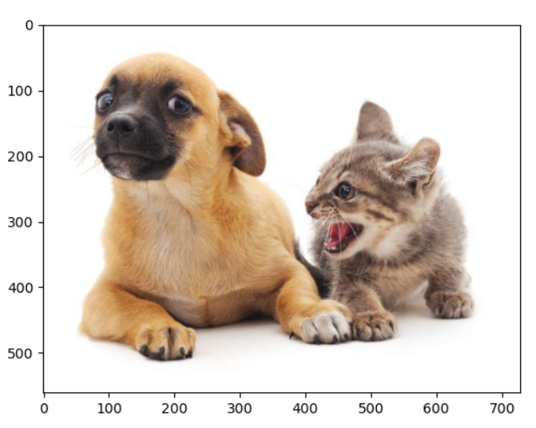
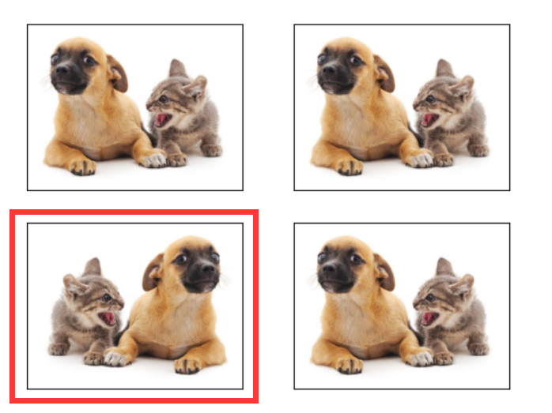
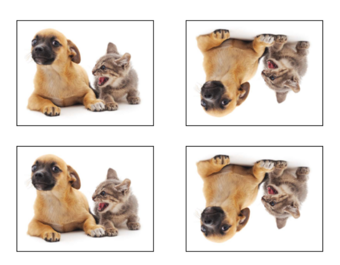
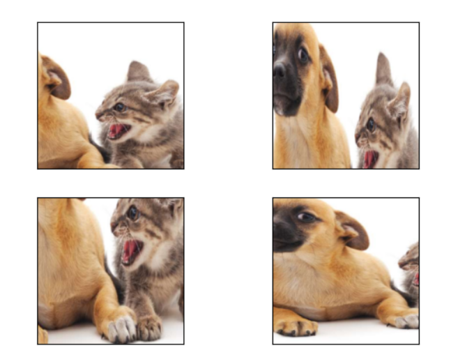
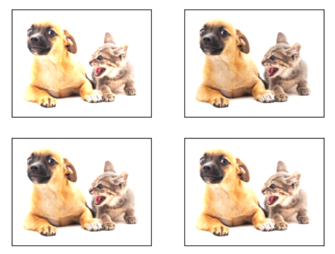
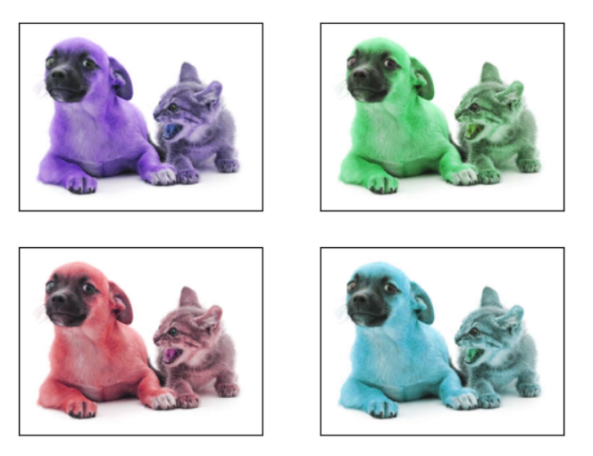
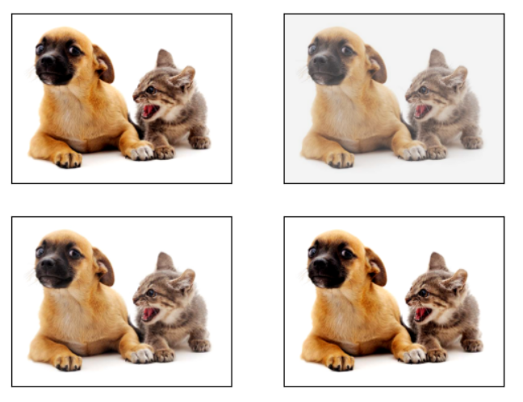
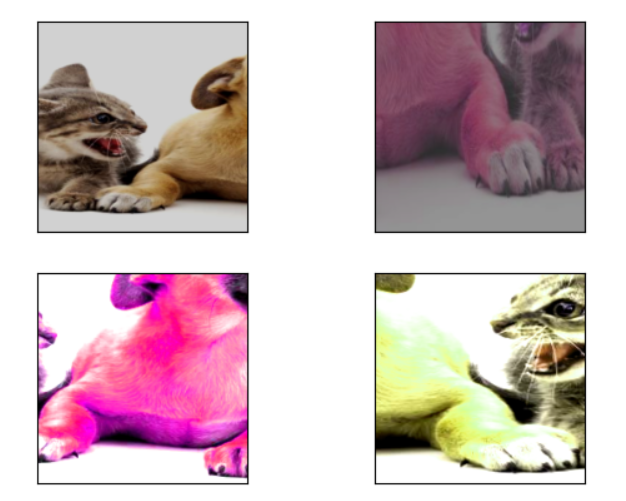

==================
图像增广
==================

- 图像增广（image augmentation）技术通过对训练图像做一系列随机改变，来产生相似但又不同的训练样本，从而 **扩大训练数据集的规模** 。
- 随机改变训练样本可以降低模型对某些属性的依赖，从而提高模型的泛化能力。
- 图像增广基于现有训练数据生成随机图像从而应对过拟合。
- **为了在预测时得到确定的结果，我们通常只将图像增广应用在训练样本上，而不在预测时使用含随机操作的图像增广。**
- 常用图像增广方法：

    - 对图像进行不同方式的 **裁剪** ，使感兴趣的物体出现在不同位置，从而减轻模型对物体出现位置的依赖性。
    - **调整亮度、色彩** 等因素来降低模型对色彩的敏感度。

- 可以从torchvision的 ``transforms`` 模块中获取有关图片增广的类。
- 原始图片如下：

翻转和裁剪
######################

- 左右翻转图像通常不改变物体的类别。
- **水平（左右）翻转** ：通过``torchvision.transforms``模块创建``RandomHorizontalFlip``实例来实现一半概率的图像水平（左右）翻转。

- **垂直（上下）翻转** 不如左右翻转通用。但是至少对于样例图像，上下翻转不会造成识别障碍。可以使用 ``RandomVerticalFlip`` 实现图像垂直（上下）翻转。

- **随机裁剪** 可以通过对图像随机裁剪来让物体以不同的比例出现在图像的不同位置，这同样能够降低模型对目标位置的敏感性。
- 在下面的代码里，我们每次随机裁剪出一块面积为原面积 :math:`10\% \sim 100\%` 的区域，且该区域的宽和高之比随机取自 :math:`0.5 \sim 2` ，然后再将该区域的宽和高分别缩放到200像素。

.. code-block:: python

    torchvision.transforms.RandomResizedCrop(200, scale=(0.1, 1), ratio=(0.5, 2))

变化颜色
######################

- **颜色** 我们可以从4个方面改变图像的颜色：亮度（brightness）、对比度（contrast）、饱和度（saturation）和色调（hue）。
- 在下面的例子里，我们将图像的亮度随机变化为原图亮度的 :math:`50\%` （ :math:`1-0.5` ） :math:`\sim 150\%` （ :math:`1+0.5` ）。

.. code-block:: python

    torchvision.transforms.ColorJitter(brightness=0.5)

- **色调** 随机变化图像的色调。

.. code-block:: python

    torchvision.transforms.ColorJitter(hue=0.5)

- **对比度** 随机变化图像的对比度。

.. code-block:: python

    torchvision.transforms.ColorJitter(contrast=0.5)

- 也可以同时设置如何随机变化图像的亮度（brightness）、对比度（contrast）、饱和度（saturation）和色调（hue）。

.. code-block:: python

    torchvision.transforms.ColorJitter(brightness=0.5, contrast=0.5, saturation=0.5, hue=0.5)

叠加多个图像增广方法
######################

- 实际应用中我们会将多个图像增广方法叠加使用。我们可以通过Compose实例将上面定义的多个图像增广方法叠加起来，再应用到每张图像之上。

.. code-block:: python

    flip_aug = torchvision.transforms.RandomHorizontalFlip()
    shape_aug = torchvision.transforms.RandomResizedCrop(200, scale=(0.1, 1), ratio=(0.5, 2))
    color_aug = torchvision.transforms.ColorJitter(brightness=0.5, contrast=0.5, saturation=0.5, hue=0.5)
    augmentation_func = torchvision.transforms.Compose([flip_aug, shape_aug, color_aug])

