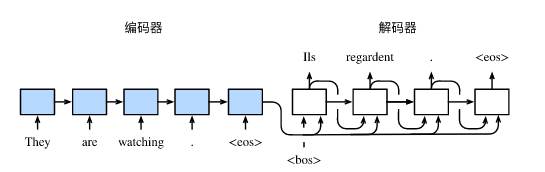
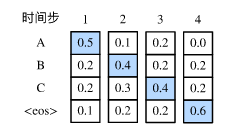
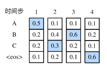
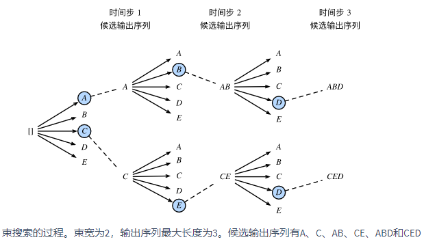

==================
基本概念
==================

seq2seq编码器解码器
######################

- 编码器-解码器（seq2seq）可以输入并输出不定长的序列。编码器—解码器使用了两个循环神经网络。
- 我在自然语言处理的很多应用中，输入和输出都可以是不定长序列。以机器翻译为例，输入可以是一段不定长的英语文本序列，输出可以是一段不定长的法语文本序列，例如

    - 英语输入：“They”、“are”、“watching”、“.”
    - 法语输出：“Ils”、“regardent”、“.”

- 当输入和输出都是不定长序列时，我们可以使用编码器—解码器（encoder-decoder）或者seq2seq模型。这两个模型本质上都用到了两个循环神经网络，分别叫做编码器和解码器。编码器用来分析输入序列，解码器用来生成输出序列。
- 下图描述了使用编码器—解码器将上述英语句子翻译成法语句子的一种方法。在训练数据集中，我们可以在每个句子后附上特殊符号“<eos>”（end of sequence）以表示序列的终止。编码器每个时间步的输入依次为英语句子中的单词、标点和特殊符号“<eos>”。下图中使用了编码器在最终时间步的隐藏状态作为输入句子的表征或编码信息。解码器在各个时间步中使用输入句子的编码信息和上个时间步的输出以及隐藏状态作为输入。我们希望解码器在各个时间步能正确依次输出翻译后的法语单词、标点和特殊符号"<eos>"。需要注意的是，解码器在最初时间步的输入用到了一个表示序列开始的特殊符号"<bos>"（beginning of sequence）。

- 参考文献：Cho, K., Van Merriënboer, B., Gulcehre, C., Bahdanau, D., Bougares, F., Schwenk, H., & Bengio, Y. (2014). Learning phrase representations using RNN encoder-decoder for statistical machine translation. arXiv preprint arXiv:1406.1078.
- 参考文献：Sutskever, I., Vinyals, O., & Le, Q. V. (2014). Sequence to sequence learning with neural networks. In Advances in neural information processing systems (pp. 3104-3112).

编码器
***************************

- 编码器的作用是把一个不定长的输入序列变换成一个定长的背景变量 :math:`\boldsymbol{c}` ，并在该背景变量中编码输入序列信息。常用的编码器是循环神经网络。
- 让我们考虑批量大小为1的时序数据样本。假设输入序列是 :math:`x_1,\ldots,x_T` ，例如 :math:`x_i` 是输入句子中的第 :math:`i` 个词。在时间步 :math:`t` ，循环神经网络将输入 :math:`x_t` 的特征向量 :math:`\boldsymbol{x}_t` 和上个时间步的隐藏状态 :math:`\boldsymbol{h}_{t-1}` 变换为当前时间步的隐藏状态 :math:`\boldsymbol{h}_t` 。我们可以用函数 :math:`f` 表达循环神经网络隐藏层的变换：

.. math::  

    \boldsymbol{h}_t = f(\boldsymbol{x}_t, \boldsymbol{h}_{t-1}).

- 接下来，编码器通过自定义函数 :math:`q` 将各个时间步的隐藏状态变换为背景变量

.. math::

    \boldsymbol{c} =  q(\boldsymbol{h}_1, \ldots, \boldsymbol{h}_T).

- 例如，当选择 :math:`q(\boldsymbol{h}_1, \ldots, \boldsymbol{h}_T) = \boldsymbol{h}_T` 时，背景变量是输入序列最终时间步的隐藏状态 :math:`\boldsymbol{h}_T` 。
- 以上描述的编码器是一个单向的循环神经网络，每个时间步的隐藏状态只取决于该时间步及之前的输入子序列。我们也可以使用双向循环神经网络构造编码器。在这种情况下，编码器每个时间步的隐藏状态同时取决于该时间步之前和之后的子序列（包括当前时间步的输入），并编码了整个序列的信息。

解码器
***************************

- 编码器输出的背景变量 :math:`\boldsymbol{c}` 编码了整个输入序列 :math:`x_1, \ldots, x_T` 的信息。给定训练样本中的输出序列 :math:`y_1, y_2, \ldots, y_{T'}` ，对每个时间步 :math:`t'` （符号与输入序列或编码器的时间步 :math:`t` 有区别），解码器输出 :math:`y_{t'}` 的条件概率将基于之前的输出序列 :math:`y_1,\ldots,y_{t'-1}` 和背景变量 :math:`\boldsymbol{c}` ，即 :math:`P(y_{t'} \mid y_1, \ldots, y_{t'-1}, \boldsymbol{c})` 。
- 为此，我们可以使用另一个循环神经网络作为解码器。在输出序列的时间步 :math:`t^\prime` ，解码器将上一时间步的输出 :math:`y_{t^\prime-1}` 以及背景变量 :math:`\boldsymbol{c}` 作为输入，并将它们与上一时间步的隐藏状态 :math:`\boldsymbol{s}_{t^\prime-1}` 变换为当前时间步的隐藏状态 :math:`\boldsymbol{s}_{t^\prime}` 。因此，我们可以用函数 :math:`g` 表达解码器隐藏层的变换：

.. math::   

    \boldsymbol{s}_{t^\prime} = g(y_{t^\prime-1}, \boldsymbol{c}, \boldsymbol{s}_{t^\prime-1}).

- 有了解码器的隐藏状态后，我们可以使用自定义的输出层和softmax运算来计算 :math:`P(y_{t^\prime} \mid y_1, \ldots, y_{t^\prime-1}, \boldsymbol{c})` ，例如，基于当前时间步的解码器隐藏状态  :math:`\boldsymbol{s}_{t^\prime}` 、上一时间步的输出 :math:`y_{t^\prime-1}` 以及背景变量 :math:`\boldsymbol{c}` 来计算当前时间步输出 :math:`y_{t^\prime}` 的概率分布。

训练模型
***************************

- 根据最大似然估计，我们可以最大化输出序列基于输入序列的条件概率

.. math:: 

    \begin{aligned}
    P(y_1, \ldots, y_{T'} \mid x_1, \ldots, x_T)
    &= \prod_{t'=1}^{T'} P(y_{t'} \mid y_1, \ldots, y_{t'-1}, x_1, \ldots, x_T)\\
    &= \prod_{t'=1}^{T'} P(y_{t'} \mid y_1, \ldots, y_{t'-1}, \boldsymbol{c}),
    \end{aligned}

并得到该输出序列的损失

.. math::

    -\log P(y_1, \ldots, y_{T'} \mid x_1, \ldots, x_T) = -\sum_{t'=1}^{T'} \log P(y_{t'} \mid y_1, \ldots, y_{t'-1}, \boldsymbol{c}),

- 在模型训练中，所有输出序列损失的均值通常作为需要最小化的损失函数。在上所描述的模型预测中，我们需要将解码器在上一个时间步的输出作为当前时间步的输入。与此不同，在训练中我们也可以将标签序列（训练集的真实输出序列）在上一个时间步的标签作为解码器在当前时间步的输入。这叫作强制教学（teacher forcing）。

解码搜索
######################

- 假设解码器的输出是一段文本序列。设输出文本词典 :math:`\mathcal{Y}` （包含特殊符号"<eos>"）的大小为 :math:`\left|\mathcal{Y}\right|` ，输出序列的最大长度为 :math:`T'` 。所有可能的输出序列一共有 :math:`\mathcal{O}(\left|\mathcal{Y}\right|^{T'})` 种。这些输出序列中所有特殊符号"<eos>"后面的子序列将被舍弃。
- 预测不定长序列的方法包括贪婪搜索、穷举搜索和束搜索。

贪婪搜索
***************************

- 让我们先来看一个简单的解决方案：贪婪搜索（greedy search）。对于输出序列任一时间步 :math:`t'` ，我们从 :math:`|\mathcal{Y}|` 个词中搜索出条件概率最大的词

.. math::  

    y _ { t ^ { \prime } } = \underset { y \in \mathcal { Y } } { \operatorname { argmax } } P \left( y | y _ { 1 } , \ldots , y _ { t ^ { \prime } - 1 } , c \right)

- 作为输出。一旦搜索出"<eos>"符号，或者输出序列长度已经达到了最大长度 :math:`T'` ，便完成输出。
- 基于输入序列生成输出序列的条件概率是 :math:`\prod_{t'=1}^{T'} P(y_{t'} \mid y_1, \ldots, y_{t'-1}, \boldsymbol{c})` 。我们将该条件概率最大的输出序列称为最优输出序列。而贪婪搜索的主要问题是不能保证得到最优输出序列。
- 下面来看一个例子。假设输出词典里面有“A”“B”“C”和“<eos>”这4个词。下图中每个时间步下的4个数字分别代表了该时间步生成“A”“B”“C”和“<eos>”这4个词的条件概率。在每个时间步，贪婪搜索选取条件概率最大的词。因此，下图中将生成输出序列“A”“B”“C”“<eos>”。该输出序列的条件概率是 :math:`0.5\times0.4\times0.4\times0.6 = 0.048` 。

- 下图在时间步2中选取了条件概率第二大的词“C”。由于时间步3所基于的时间步1和2的输出子序列由上图中的“A”“B”变为了下图中的“A”“C”，下图中时间步3生成各个词的条件概率发生了变化。我们选取条件概率最大的词“B”。此时时间步4所基于的前3个时间步的输出子序列为“A”“C”“B”，与上图中的“A”“B”“C”不同。因此，下图中时间步4生成各个词的条件概率也与上图中的不同。我们发现，此时的输出序列“A”“C”“B”“<eos>”的条件概率是 :math:`0.5\times0.3\times0.6\times0.6=0.054` ，大于贪婪搜索得到的输出序列的条件概率。因此，贪婪搜索得到的输出序列“A”“B”“C”“<eos>”并非最优输出序列。

穷举搜索
***************************

- 如果目标是得到最优输出序列，我们可以考虑穷举搜索（exhaustive search）：穷举所有可能的输出序列，输出条件概率最大的序列。
- 虽然穷举搜索可以得到最优输出序列，但它的计算开销 :math:`\mathcal{O}(\left|\mathcal{Y}\right|^{T'})` 很容易过大。例如，当 :math:`|\mathcal{Y}|=10000` 且 :math:`T'=10` 时，我们将评估 :math:`10000^{10} = 10^{40}` 个序列：这几乎不可能完成。而贪婪搜索的计算开销是 :math:`\mathcal{O}(\left|\mathcal{Y}\right|T')` ，通常显著小于穷举搜索的计算开销。例如，当 :math:`|\mathcal{Y}|=10000` 且 :math:`T'=10` 时，我们只需评估 :math:`10000\times10=10^5` 个序列。

集束搜索
***************************

- 束搜索通过灵活的束宽来权衡计算开销和搜索质量。
- 束搜索（beam search）是对贪婪搜索的一个改进算法。它有一个束宽（beam size）超参数。我们将它设为 :math:`k` 。在时间步1时，选取当前时间步条件概率最大的 :math:`k` 个词，分别组成 :math:`k` 个候选输出序列的首词。在之后的每个时间步，基于上个时间步的 :math:`k` 个候选输出序列，从 :math:`k\left|\mathcal{Y}\right|` 个可能的输出序列中选取条件概率最大的 :math:`k` 个，作为该时间步的候选输出序列。最终，我们从各个时间步的候选输出序列中筛选出包含特殊符号“<eos>”的序列，并将它们中所有特殊符号“<eos>”后面的子序列舍弃，得到最终候选输出序列的集合。

- 下图通过一个例子演示了束搜索的过程。假设输出序列的词典中只包含5个元素，即 :math:`\mathcal{Y} = \{A, B, C, D, E\}` ，且其中一个为特殊符号“<eos>”。设束搜索的束宽等于2，输出序列最大长度为3。在输出序列的时间步1时，假设条件概率 :math:`P(y_1 \mid \boldsymbol{c})` 最大的2个词为 :math:`A` 和 :math:`C` 。我们在时间步2时将对所有的 :math:`y_2 \in \mathcal{Y}` 都分别计算 :math:`P(y_2 \mid A, \boldsymbol{c})` 和 :math:`P(y_2 \mid C, \boldsymbol{c})` ，并从计算出的10个条件概率中取最大的2个，假设为 :math:`P(B \mid A, \boldsymbol{c})` 和 :math:`P(E \mid C, \boldsymbol{c})` 。那么，我们在时间步3时将对所有的 :math:`y_3 \in \mathcal{Y}` 都分别计算 :math:`P(y_3 \mid A, B, \boldsymbol{c})` 和 :math:`P(y_3 \mid C, E, \boldsymbol{c})` ，并从计算出的10个条件概率中取最大的2个，假设为 :math:`P(D \mid A, B, \boldsymbol{c})` 和 :math:`P(D \mid C, E, \boldsymbol{c})` 。如此一来，我们得到6个候选输出序列：（1） :math:`A` ；（2） :math:`C` ；（3） :math:`A` 、 :math:`B` ；（4） :math:`C` 、 :math:`E` ；（5） :math:`A` 、 :math:`B` 、 :math:`D` 和（6） :math:`C` 、 :math:`E` 、 :math:`D` 。接下来，我们将根据这6个序列得出最终候选输出序列的集合。
- 在最终候选输出序列的集合中，我们取以下分数最高的序列作为输出序列：

.. math::

    \frac{1}{L^\alpha} \log P(y_1, \ldots, y_{L}) = \frac{1}{L^\alpha} \sum_{t'=1}^L \log P(y_{t'} \mid y_1, \ldots, y_{t'-1}, \boldsymbol{c}),

- 其中 :math:`L` 为最终候选序列长度， :math:`\alpha` 一般可选为0.75。分母上的 :math:`L^\alpha` 是为了惩罚较长序列在以上分数中较多的对数相加项。分析可知，束搜索的计算开销为 :math:`\mathcal{O}(k\left|\mathcal{Y}\right|T')` 。这介于贪婪搜索和穷举搜索的计算开销之间。此外，贪婪搜索可看作是束宽为1的束搜索。束搜索通过灵活的束宽 :math:`k` 来权衡计算开销和搜索质量。
