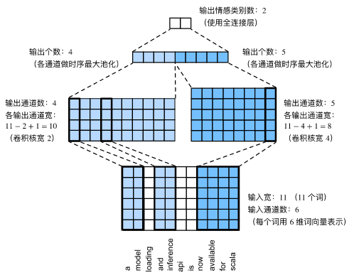

==================
文本分类
==================

textCNN模型
######################

- textCNN模型主要使用了一维卷积层和时序最大池化层。假设输入的文本序列由 :math:`n` 个词组成，每个词用 :math:`d` 维的词向量表示。那么输入样本的宽为 :math:`n` ，高为1，输入通道数为 :math:`d` 。textCNN的计算主要分为以下几步。

1. 定义多个一维卷积核，并使用这些卷积核对输入分别做卷积计算。宽度不同的卷积核可能会捕捉到不同个数的相邻词的相关性。
2. 对输出的所有通道分别做时序最大池化，再将这些通道的池化输出值连结为向量。
3. 通过全连接层将连结后的向量变换为有关各类别的输出。这一步可以使用丢弃层应对过拟合。

- 下图用一个例子解释了textCNN的设计。这里的输入是一个有11个词的句子，每个词用6维词向量表示。因此输入序列的宽为11，输入通道数为6。给定2个一维卷积核，核宽分别为2和4，输出通道数分别设为4和5。因此，一维卷积计算后，4个输出通道的宽为 :math:`11-2+1=10` ，而其他5个通道的宽为 :math:`11-4+1=8` 。尽管每个通道的宽不同，我们依然可以对各个通道做时序最大池化，并将9个通道的池化输出连结成一个9维向量。最终，使用全连接将9维向量变换为2维输出，即正面情感和负面情感的预测。

- 可以使用一维卷积来表征时序数据。
- 参考文献：Kim, Y. (2014). Convolutional neural networks for sentence classification. arXiv preprint arXiv:1408.5882.