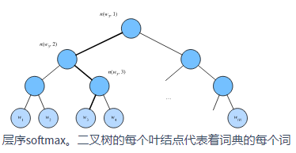

==================
词嵌入
==================

- 词嵌入（word embedding）：词向量是用来表示词的向量，也可被认为是词的特征向量或表征。把词映射为实数域向量的技术也叫词嵌入。

嵌入层
######################

- 获取词嵌入的层称为嵌入层，在PyTorch中可以通过创建 ``nn.Embedding`` 实例得到。嵌入层的权重是一个矩阵，其行数为词典大小（num_embeddings），列数为每个词向量的维度（embedding_dim）。我们设词典大小为10，词向量的维度为4。
- 输入形状： ``Input: (*)`` 输出形状： ``Output: (*, embedding_dim)``  输入类型：  ``LongTensor``
- 嵌入层的输入为词的索引。输入一个词的索引 :math:`i` ，嵌入层返回权重矩阵的第 :math:`i` 行作为它的词向量。假设形状为(2, 3)的索引输入进嵌入层，由于词向量的维度为4，我们得到形状为(2, 3, 4)的词向量。

.. code-block:: python

    vocabulary_size = 20
    embed = nn.Embedding(num_embeddings=vocabulary_size, embedding_dim=4)
    print(embed.weight.shape)  # torch.Size([20, 4])
    x = torch.LongTensor([[1, 2, 4, 5], [4, 3, 2, 9]])
    print(x.shape)  # torch.Size([2, 4])
    y = embed(x)
    print(y.shape)  # torch.Size([2, 4, 4])
    print(y)
    """
    tensor([[[ 2.0844,  0.4803, -0.8572,  0.5418],
        [ 0.9904,  1.0953,  0.4437, -0.2486],
        [-0.5855, -0.3845,  0.9660,  2.9621],
        [ 0.7133, -0.2607, -0.3606,  0.9859]],

    [[-0.5855, -0.3845,  0.9660,  2.9621],
        [ 0.8078,  0.9533,  0.1714, -0.1832],
        [ 0.9904,  1.0953,  0.4437, -0.2486],
        [ 0.7199, -0.0607,  0.1369, -1.6945]]], grad_fn=<EmbeddingBackward>)
    """

Word2vec
######################

- Word2Vec-知其然知其所以然: https://www.zybuluo.com/Dounm/note/591752
- word2vec工具的提出正是为了解决“由于任何两个不同词的one-hot向量的余弦相似度都为0，多个不同词之间的相似度难以通过one-hot向量准确地体现出来”这个问题。它将每个词表示成一个定长的向量，并使得这些向量能较好地表达不同词之间的相似和类比关系。word2vec工具包含了两个模型，即跳字模型（skip-gram）和连续词袋模型（continuous bag of words，CBOW）。
- 参考文献：Mikolov, T., Sutskever, I., Chen, K., Corrado, G. S., & Dean, J. (2013). Distributed representations of words and phrases and their compositionality. In Advances in neural information processing systems (pp. 3111-3119).

跳字模型
***************************

- 跳字模型（skip-gram）：假设基于某个词来生成它在文本序列周围的词。举个例子，假设文本序列是“the”“man”“loves”“his”“son”。以“loves”作为中心词，设背景窗口大小为2。如下图所示，跳字模型所关心的是，给定中心词“loves”，生成与它距离不超过2个词的背景词“the”“man”“his”“son”的条件概率，即

.. image:: ./word_embedding.assets/skip_gram_20200331231125.png
    :alt:
    :align: center

.. math::

    P(\textrm{``the"},\textrm{``man"},\textrm{``his"},\textrm{``son"}\mid\textrm{``loves"}).

- 假设给定中心词的情况下，背景词的生成是相互独立的，那么上式可以改写成

.. math::

    P(\textrm{``the"}\mid\textrm{``loves"})\cdot P(\textrm{``man"}\mid\textrm{``loves"})\cdot P(\textrm{``his"}\mid\textrm{``loves"})\cdot P(\textrm{``son"}\mid\textrm{``loves"}).

- 在跳字模型中，每个词被表示成两个 :math:`d` 维向量，用来计算条件概率。假设这个词在词典中索引为 :math:`i` ，当它为中心词时向量表示为 :math:`\boldsymbol{v}_i\in\mathbb{R}^d` ，而为背景词时向量表示为 :math:`\boldsymbol{u}_i\in\mathbb{R}^d` 。设中心词 :math:`w_c` 在词典中索引为 :math:`c` ，背景词 :math:`w_o` 在词典中索引为 :math:`o` ，给定中心词生成背景词的条件概率可以通过对向量内积做softmax运算而得到：

.. math::

    P(w_o \mid w_c) = \frac{\text{exp}(\boldsymbol{u}_o^\top \boldsymbol{v}_c)}{ \sum_{i \in \mathcal{V}} \text{exp}(\boldsymbol{u}_i^\top \boldsymbol{v}_c)},

- 其中词典索引集 :math:`\mathcal{V} = \{0, 1, \ldots, |\mathcal{V}|-1\}` 。假设给定一个长度为 :math:`T` 的文本序列，设时间步 :math:`t` 的词为 :math:`w^{(t)}` 。假设给定中心词的情况下背景词的生成相互独立，当背景窗口大小为 :math:`m` 时，跳字模型的似然函数即给定任一中心词生成所有背景词的概率

.. math::

    \prod_{t=1}^{T} \prod_{-m \leq j \leq m,\ j \neq 0} P(w^{(t+j)} \mid w^{(t)}),

- 这里小于1和大于 :math:`T` 的时间步可以忽略。

训练跳字模型
***************************

- 跳字模型的参数是每个词所对应的中心词向量和背景词向量。训练中我们通过最大化似然函数来学习模型参数，即最大似然估计。这等价于最小化以下损失函数：

.. math::

    - \sum_{t=1}^{T} \sum_{-m \leq j \leq m,\ j \neq 0} \text{log}\, P(w^{(t+j)} \mid w^{(t)}).

- 如果使用随机梯度下降，那么在每一次迭代里我们随机采样一个较短的子序列来计算有关该子序列的损失，然后计算梯度来更新模型参数。梯度计算的关键是条件概率的对数有关中心词向量和背景词向量的梯度。根据定义，首先看到

.. math::

    \log P(w_o \mid w_c) = \boldsymbol{u}_o^\top \boldsymbol{v}_c - \log\left(\sum_{i \in \mathcal{V}} \text{exp}(\boldsymbol{u}_i^\top \boldsymbol{v}_c)\right)

- 通过微分，我们可以得到上式中 :math:`\boldsymbol{v}_c` 的梯度

.. math::

    \begin{aligned}
    \frac{\partial \text{log}\, P(w_o \mid w_c)}{\partial \boldsymbol{v}_c}
    &= \boldsymbol{u}_o - \frac{\sum_{j \in \mathcal{V}} \exp(\boldsymbol{u}_j^\top \boldsymbol{v}_c)\boldsymbol{u}_j}{\sum_{i \in \mathcal{V}} \exp(\boldsymbol{u}_i^\top \boldsymbol{v}_c)}\\
    &= \boldsymbol{u}_o - \sum_{j \in \mathcal{V}} \left(\frac{\text{exp}(\boldsymbol{u}_j^\top \boldsymbol{v}_c)}{ \sum_{i \in \mathcal{V}} \text{exp}(\boldsymbol{u}_i^\top \boldsymbol{v}_c)}\right) \boldsymbol{u}_j\\
    &= \boldsymbol{u}_o - \sum_{j \in \mathcal{V}} P(w_j \mid w_c) \boldsymbol{u}_j.
    \end{aligned}

- 它的计算需要词典中所有词以 :math:`w_c` 为中心词的条件概率。有关其他词向量的梯度同理可得。
- 训练结束后，对于词典中的任一索引为 :math:`i` 的词，我们均得到该词作为中心词和背景词的两组词向量 :math:`\boldsymbol{v}_i` 和 :math:`\boldsymbol{u}_i` 。在自然语言处理应用中，一般使用跳字模型的中心词向量作为词的表征向量。

连续词袋模型
***************************

- 连续词袋模型（continuous bag of words，CBOW）与跳字模型类似。与跳字模型最大的不同在于，连续词袋模型假设基于某中心词在文本序列前后的背景词来生成该中心词。在同样的文本序列“the”“man”“loves”“his”“son”里，以“loves”作为中心词，且背景窗口大小为2时，连续词袋模型关心的是，给定背景词“the”“man”“his”“son”生成中心词“loves”的条件概率（如下图所示），也就是

.. math::

    P(\textrm{``loves"}\mid\textrm{``the"},\textrm{``man"},\textrm{``his"},\textrm{``son"}).

- 因为连续词袋模型的背景词有多个，我们将这些背景词向量取平均，然后使用和跳字模型一样的方法来计算条件概率。设 :math:`\boldsymbol{v_i}\in\mathbb{R}^d` 和 :math:`\boldsymbol{u_i}\in\mathbb{R}^d` 分别表示词典中索引为 :math:`i` 的词作为背景词和中心词的向量（注意符号的含义与跳字模型中的相反）。设中心词 :math:`w_c` 在词典中索引为 :math:`c` ，背景词 :math:`w_{o_1}, \ldots, w_{o_{2m}}` 在词典中索引为 :math:`o_1, \ldots, o_{2m}` ，那么给定背景词生成中心词的条件概率

.. math::

    P(w_c \mid w_{o_1}, \ldots, w_{o_{2m}}) = \frac{\text{exp}\left(\frac{1}{2m}\boldsymbol{u}_c^\top (\boldsymbol{v}_{o_1} + \ldots + \boldsymbol{v}_{o_{2m}}) \right)}{ \sum_{i \in \mathcal{V}} \text{exp}\left(\frac{1}{2m}\boldsymbol{u}_i^\top (\boldsymbol{v}_{o_1} + \ldots + \boldsymbol{v}_{o_{2m}}) \right)}.

- 为了让符号更加简单，我们记 :math:`\mathcal{W}_o= \{w_{o_1}, \ldots, w_{o_{2m}}\}` ，且 :math:`\bar{\boldsymbol{v}}_o = \left(\boldsymbol{v}_{o_1} + \ldots + \boldsymbol{v}_{o_{2m}} \right)/(2m)` ，那么上式可以简写成

.. math::

    P(w_c \mid \mathcal{W}_o) = \frac{\exp\left(\boldsymbol{u}_c^\top \bar{\boldsymbol{v}}_o\right)}{\sum_{i \in \mathcal{V}} \exp\left(\boldsymbol{u}_i^\top \bar{\boldsymbol{v}}_o\right)}.

- 给定一个长度为 :math:`T` 的文本序列，设时间步 :math:`t` 的词为 :math:`w^{(t)}` ，背景窗口大小为 :math:`m` 。连续词袋模型的似然函数是由背景词生成任一中心词的概率

.. math::

    \prod_{t=1}^{T}  P(w^{(t)} \mid  w^{(t-m)}, \ldots,  w^{(t-1)},  w^{(t+1)}, \ldots,  w^{(t+m)}).

训练连续词袋模型
***************************

- 训练连续词袋模型同训练跳字模型基本一致。连续词袋模型的最大似然估计等价于最小化损失函数

.. math::

    -\sum_{t=1}^T  \text{log}\, P(w^{(t)} \mid  w^{(t-m)}, \ldots,  w^{(t-1)},  w^{(t+1)}, \ldots,  w^{(t+m)}).

- 注意到

.. math::

    \log\,P(w_c \mid \mathcal{W}_o) = \boldsymbol{u}_c^\top \bar{\boldsymbol{v}}_o - \log\,\left(\sum_{i \in \mathcal{V}} \exp\left(\boldsymbol{u}_i^\top \bar{\boldsymbol{v}}_o\right)\right).

- 通过微分，我们可以计算出上式中条件概率的对数有关任一背景词向量 :math:`\boldsymbol{v}_{o_i}` （ :math:`i = 1, \ldots, 2m` ）的梯度

.. math::

    \frac{\partial \log\, P(w_c \mid \mathcal{W}_o)}{\partial \boldsymbol{v}_{o_i}} = \frac{1}{2m} \left(\boldsymbol{u}_c - \sum_{j \in \mathcal{V}} \frac{\exp(\boldsymbol{u}_j^\top \bar{\boldsymbol{v}}_o)\boldsymbol{u}_j}{ \sum_{i \in \mathcal{V}} \text{exp}(\boldsymbol{u}_i^\top \bar{\boldsymbol{v}}_o)} \right) = \frac{1}{2m}\left(\boldsymbol{u}_c - \sum_{j \in \mathcal{V}} P(w_j \mid \mathcal{W}_o) \boldsymbol{u}_j \right).

- 有关其他词向量的梯度同理可得。同跳字模型不一样的一点在于，我们一般使用连续词袋模型的背景词向量作为词的表征向量。

word2vec的实现
***************************

- word2vec的实现: https://tangshusen.me/Dive-into-DL-PyTorch/#/chapter10_natural-language-processing/10.3_word2vec-pytorch
- **掩码变量** 我们可以通过掩码变量指定小批量中参与损失函数计算的部分预测值和标签：当掩码为1时，相应位置的预测值和标签将参与损失函数的计算；当掩码为0时，相应位置的预测值和标签则不参与损失函数的计算。掩码变量可用于避免填充项对损失函数计算的影响。
- 掩码变量用途：可以将长度不同的样本填充至长度相同的小批量，并通过掩码变量区分非填充和填充，然后只令非填充参与损失函数的计算。

二次采样
========================

- 二次采样（subsampling）:文本数据中一般会出现一些高频词，如英文中的“the”“a”和“in”。通常来说，在一个背景窗口中，一个词（如“chip”）和较低频词（如“microprocessor”）同时出现比和较高频词（如“the”）同时出现对训练词嵌入模型更有益。因此，训练词嵌入模型时可以对词进行二次采样。
- 具体来说，数据集中每个被索引词 :math:`w_i` 将有一定概率被丢弃，该丢弃概率为

.. math:: 

    P(w_i) = \max\left(1 - \sqrt{\frac{t}{f(w_i)}}, 0\right),

- 其中  :math:`f(w_i)`  是数据集中词 :math:`w_i` 的个数与总词数之比，常数 :math:`t` 是一个超参数（实验中设为 :math:`10^{-4}` ）。可见，只有当 :math:`f(w_i) > t` 时，我们才有可能在二次采样中丢弃词 :math:`w_i` ，并且越高频的词被丢弃的概率越大。

近似训练
######################

- 在word2vec中，由于softmax运算考虑了背景词可能是词典 :math:`\mathcal{V}` 中的任一词，以上损失包含了词典大小数目的项的累加。不论是跳字模型还是连续词袋模型，由于条件概率使用了softmax运算，每一步的梯度计算都包含词典大小数目的项的累加。对于含几十万或上百万词的较大词典，每次的梯度 **计算开销可能过大** 。为了降低该计算复杂度，可以使用两种近似训练方法，即负采样（negative sampling）或层序softmax（hierarchical softmax）。

负采样
***************************

- 负采样（negative sampling）通过考虑同时含有正类样本和负类样本的相互独立事件来构造损失函数。其训练中每一步的梯度计算开销与采样的噪声词的个数线性相关。
- 负采样修改了原来的目标函数。给定中心词 :math:`w_c` 的一个背景窗口，我们把背景词 :math:`w_o` 出现在该背景窗口看作一个事件，并将该事件的概率计算为

.. math::

    P(D=1\mid w_c, w_o) = \sigma(\boldsymbol{u}_o^\top \boldsymbol{v}_c),

- 其中的 :math:`\sigma` 函数与sigmoid激活函数的定义相同：

.. math::

    \sigma(x) = \frac{1}{1+\exp(-x)}.

- 我们先考虑最大化文本序列中所有该事件的联合概率来训练词向量。具体来说，给定一个长度为 :math:`T` 的文本序列，设时间步 :math:`t` 的词为 :math:`w^{(t)}` 且背景窗口大小为 :math:`m` ，考虑最大化联合概率

.. math::

    \prod_{t=1}^{T} \prod_{-m \leq j \leq m,\ j \neq 0} P(D=1\mid w^{(t)}, w^{(t+j)}).

- 然而，以上模型中包含的事件仅考虑了正类样本。这导致当所有词向量相等且值为无穷大时，以上的联合概率才被最大化为1。很明显，这样的词向量毫无意义。负采样通过采样并添加负类样本使目标函数更有意义。设背景词 :math:`w_o` 出现在中心词 :math:`w_c` 的一个背景窗口为事件 :math:`P` ，我们根据分布 :math:`P(w)` 采样 :math:`K` 个未出现在该背景窗口中的词，即噪声词。设噪声词 :math:`w_k` （ :math:`k=1, \ldots, K` ）不出现在中心词 :math:`w_c` 的该背景窗口为事件 :math:`N_k` 。假设同时含有正类样本和负类样本的事件 :math:`P, N_1, \ldots, N_K` 相互独立，负采样将以上需要最大化的仅考虑正类样本的联合概率改写为

.. math::

    \prod_{t=1}^{T} \prod_{-m \leq j \leq m,\ j \neq 0} P(w^{(t+j)} \mid w^{(t)}),

- 其中条件概率被近似表示为

.. math::

    P(w^{(t+j)} \mid w^{(t)}) =P(D=1\mid w^{(t)}, w^{(t+j)})\prod_{k=1,\ w_k \sim P(w)}^K P(D=0\mid w^{(t)}, w_k).

- 设文本序列中时间步 :math:`t` 的词 :math:`w^{(t)}` 在词典中的索引为 :math:`i_t` ，噪声词 :math:`w_k` 在词典中的索引为 :math:`h_k` 。有关以上条件概率的对数损失为

.. math::

	\begin{aligned}
	-\log P(w^{(t+j)} \mid w^{(t)})
	=& -\log P(D=1\mid w^{(t)}, w^{(t+j)}) - \sum_{k=1,\ w_k \sim P(w)}^K \log P(D=0\mid w^{(t)}, w_k)\\
	=&-  \log\, \sigma\left(\boldsymbol{u}_{i_{t+j}}^\top \boldsymbol{v}_{i_t}\right) - \sum_{k=1,\ w_k \sim P(w)}^K \log\left(1-\sigma\left(\boldsymbol{u}_{h_k}^\top \boldsymbol{v}_{i_t}\right)\right)\\
	=&-  \log\, \sigma\left(\boldsymbol{u}_{i_{t+j}}^\top \boldsymbol{v}_{i_t}\right) - \sum_{k=1,\ w_k \sim P(w)}^K \log\sigma\left(-\boldsymbol{u}_{h_k}^\top \boldsymbol{v}_{i_t}\right).
	\end{aligned}

- 现在，训练中每一步的梯度计算开销不再与词典大小相关，而与 :math:`K` 线性相关。当 :math:`K` 取较小的常数时，负采样在每一步的梯度计算开销较小。

层序softmax
***************************

- 层序softmax（hierarchical softmax）是另一种近似训练法。它使用了二叉树这一数据结构，树的每个叶结点代表词典 :math:`\mathcal{V}` 中的每个词。
- 层序softmax使用了二叉树，并根据根结点到叶结点的路径来构造损失函数。其训练中每一步的梯度计算开销与词典大小的对数相关。

- 假设 :math:`L(w)` 为从二叉树的根结点到词 :math:`w` 的叶结点的路径（包括根结点和叶结点）上的结点数。设 :math:`n(w,j)` 为该路径上第 :math:`j` 个结点，并设该结点的背景词向量为 :math:`\boldsymbol{u}_{n(w,j)}` 。以图10.3为例， :math:`L(w_3) = 4` 。层序softmax将跳字模型中的条件概率近似表示为

.. math::

    P(w_o \mid w_c) = \prod_{j=1}^{L(w_o)-1} \sigma\left( [\![  n(w_o, j+1) = \text{leftChild}(n(w_o,j)) ]\!] \cdot \boldsymbol{u}_{n(w_o,j)}^\top \boldsymbol{v}_c\right),

- 其中 :math:`\sigma` 函数与（多层感知机）中sigmoid激活函数的定义相同， :math:`\text{leftChild}(n)` 是结点 :math:`n` 的左子结点：如果判断 :math:`x` 为真， :math:`[\![x]\!] = 1` ；反之 :math:`[\![x]\!] = -1` 。
- 让我们计算图10.3中给定词 :math:`w_c` 生成词 :math:`w_3` 的条件概率。我们需要将 :math:`w_c` 的词向量 :math:`\boldsymbol{v}_c` 和根结点到 :math:`w_3` 路径上的非叶结点向量一一求内积。由于在二叉树中由根结点到叶结点 :math:`w_3` 的路径上需要向左、向右再向左地遍历（图10.3中加粗的路径），我们得到

.. math::

    P(w_3 \mid w_c) = \sigma(\boldsymbol{u}_{n(w_3,1)}^\top \boldsymbol{v}_c) \cdot \sigma(-\boldsymbol{u}_{n(w_3,2)}^\top \boldsymbol{v}_c) \cdot \sigma(\boldsymbol{u}_{n(w_3,3)}^\top \boldsymbol{v}_c).

- 由于 :math:`\sigma(x)+\sigma(-x) = 1` ，给定中心词 :math:`w_c` 生成词典 :math:`\mathcal{V}` 中任一词的条件概率之和为1这一条件也将满足：

.. math::

    \sum_{w \in \mathcal{V}} P(w \mid w_c) = 1.

- 此外，由于 :math:`L(w_o)-1` 的数量级为 :math:`\mathcal{O}(\text{log}_2|\mathcal{V}|)` ，当词典 :math:`\mathcal{V}` 很大时，层序softmax在训练中每一步的梯度计算开销相较未使用近似训练时大幅降低。

子词嵌入（fastText）
######################

- fastText提出了子词嵌入方法。它在word2vec中的跳字模型的基础上，将中心词向量表示成单词的子词向量之和。
- 子词嵌入利用构词上的规律，通常可以提升生僻词表示的质量。
- 在fastText中，每个中心词被表示成子词的集合。下面我们用单词“where”作为例子来了解子词是如何产生的。首先，我们在单词的首尾分别添加特殊字符“<”和“>”以区分作为前后缀的子词。然后，将单词当成一个由字符构成的序列来提取 :math:`n` 元语法。例如，当 :math:`n=3` 时，我们得到所有长度为3的子词：“<wh>”“whe”“her”“ere”“<re>”以及特殊子词“<where>”。
- 在fastText中，对于一个词 :math:`w` ，我们将它所有长度在 :math:`3 \sim 6` 的子词和特殊子词的并集记为 :math:`\mathcal{G}_w` 。那么词典则是所有词的子词集合的并集。假设词典中子词 :math:`g` 的向量为 :math:`\boldsymbol{z}_g` ，那么跳字模型中词 :math:`w` 的作为中心词的向量 :math:`\boldsymbol{v}_w` 则表示成

.. math::

    \boldsymbol{v}_w = \sum_{g\in\mathcal{G}_w} \boldsymbol{z}_g.

- fastText的其余部分同跳字模型一致，不在此重复。可以看到，与跳字模型相比，fastText中词典规模更大，造成模型参数更多，同时一个词的向量需要对所有子词向量求和，继而导致计算复杂度更高。但与此同时，较生僻的复杂单词，甚至是词典中没有的单词，可能会从同它结构类似的其他词那里获取更好的词向量表示。
- 参考文献：Bojanowski, P., Grave, E., Joulin, A., & Mikolov, T. (2016). Enriching word vectors with subword information. arXiv preprint arXiv:1607.04606.

GloVe模型
######################

- GloVe [ɡlʌv] 模型的命名取“全局向量”（Global Vectors）之意。
- 词典中往往有大量生僻词，它们在数据集中出现的次数极少。而有关大量生僻词的条件概率分布在交叉熵损失函数中的最终预测往往并不准确。
- 在有些情况下，交叉熵损失函数有劣势。GloVe模型采用了平方损失，并通过词向量拟合预先基于整个数据集计算得到的全局统计信息。任意词的中心词向量和背景词向量在GloVe模型中是等价的。
- 作为在word2vec之后提出的词嵌入模型，GloVe模型采用了平方损失，并基于该损失对跳字模型做了3点改动：

	- 1. 使用非概率分布的变量 :math:`p'_{ij}=x_{ij}` 和 :math:`q'_{ij}=\exp(\boldsymbol{u}_j^\top \boldsymbol{v}_i)` ，并对它们取对数。因此，平方损失项是 :math:`\left(\log\,p'_{ij} - \log\,q'_{ij}\right)^2 = \left(\boldsymbol{u}_j^\top \boldsymbol{v}_i - \log\,x_{ij}\right)^2` 。
	- 2. 为每个词 :math:`w_i` 增加两个为标量的模型参数：中心词偏差项 :math:`b_i` 和背景词偏差项 :math:`c_i` 。
	- 3. 将每个损失项的权重替换成函数 :math:`h(x_{ij})` 。权重函数 :math:`h(x)` 是值域在 :math:`[0,1]` 的单调递增函数。

- 如此一来，GloVe模型的目标是最小化损失函数

.. math::

    \sum_{i\in\mathcal{V}} \sum_{j\in\mathcal{V}} h(x_{ij}) \left(\boldsymbol{u}_j^\top \boldsymbol{v}_i + b_i + c_j - \log\,x_{ij}\right)^2.

- 其中权重函数 :math:`h(x)` 的一个建议选择是：当 :math:`x < c` 时（如 :math:`c = 100` ），令 :math:`h(x) = (x/c)^\alpha` （如 :math:`\alpha = 0.75` ），反之令 :math:`h(x) = 1` 。因为 :math:`h(0)=0` ，所以对于 :math:`x_{ij}=0` 的平方损失项可以直接忽略。当使用小批量随机梯度下降来训练时，每个时间步我们随机采样小批量非零 :math:`x_{ij}` ，然后计算梯度来迭代模型参数。这些非零 :math:`x_{ij}` 是预先基于整个数据集计算得到的，包含了数据集的全局统计信息。因此，GloVe模型的命名取“全局向量”（Global Vectors）之意。
- 需要强调的是，如果词 :math:`w_i` 出现在词 :math:`w_j` 的背景窗口里，那么词 :math:`w_j` 也会出现在词 :math:`w_i` 的背景窗口里。也就是说， :math:`x_{ij}=x_{ji}` 。不同于word2vec中拟合的是非对称的条件概率 :math:`p_{ij}` ，GloVe模型拟合的是对称的 :math:`\log\, x_{ij}` 。因此，任意词的中心词向量和背景词向量在GloVe模型中是等价的。但由于初始化值的不同，同一个词最终学习到的两组词向量可能不同。当学习得到所有词向量以后，GloVe模型使用中心词向量与背景词向量之和作为该词的最终词向量。
- 参考文献：Pennington, J., Socher, R., & Manning, C. (2014). Glove: Global vectors for word representation. In Proceedings of the 2014 conference on empirical methods in natural language processing (EMNLP) (pp. 1532-1543).