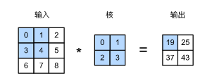
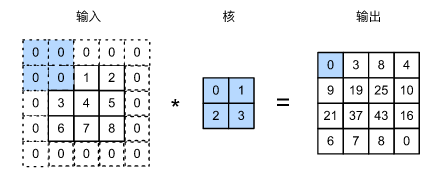
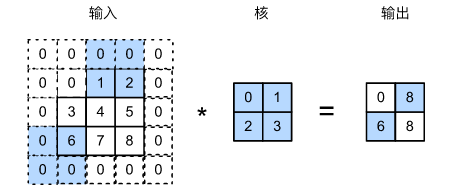
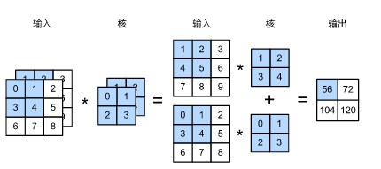
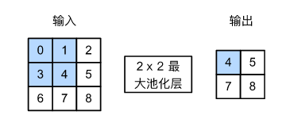
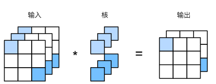

==================
卷积神经网络
==================

- 卷积神经网络（convolutional neural network）是含有卷积层（convolutional layer）的神经网络。
- 卷积层的输入和输出通常是 **四维数组（样本，通道，高，宽）** ，而全连接层的输入和输出则通常是 **二维数组（样本，特征）**。

二维卷积
######################

卷积层
***************************

- 虽然卷积层得名于卷积（convolution）运算，但我们通常在卷积层中使用更加直观的互相关（cross-correlation）运算。在二维卷积层中，一个二维输入数组和一个二维核（kernel）数组（又称卷积核或过滤器（filter））通过互相关运算输出一个二维数组。图中的阴影部分为第一个输出元素及其计算所使用的输入和核数组元素： :math:`0\times0+1\times1+3\times2+4\times3=19` 。

- 二维卷积层将输入和卷积核做互相关运算，并加上一个标量偏差来得到输出。 **卷积层的模型参数包括了卷积核和标量偏差** 。在训练模型的时候，通常我们先对卷积核随机初始化，然后不断迭代卷积核和偏差。

- **填充（padding）** 是指在输入高和宽的两侧填充元素（通常是0元素）。下图里我们在原输入高和宽的两侧分别添加了值为0的元素，使得输入高和宽从3变成了5。填充可以增加输出的高和宽。这常用来使输出与输入具有相同的高和宽。

- **步幅（stride）** 即为每次滑动的行数和列数。下图展示了在高上步幅为3、在宽上步幅为2的二维互相关运算。步幅可以减小输出的高和宽。

- **通道（channel）** 例如，彩色图像在高和宽2个维度外还有RGB（红、绿、蓝）3个颜色通道。假设彩色图像的高和宽分别是 :math:`h` 和 :math:`w` （像素），那么它可以表示为一个 :math:`3\times h\times w` 的多维数组。我们将大小为3的这一维称为通道（channel）维。当输入数据含多个通道时，我们需要构造一个输入通道数与输入数据的通道数相同的卷积核，从而能够与含多通道的输入数据做互相关运算。下图展示了含2个输入通道的二维互相关计算的例子。在每个通道上，二维输入数组与二维核数组做互相关运算， **再按通道相加** 即得到输出。图5.4中阴影部分为第一个输出元素及其计算所使用的输入和核数组元素： :math:`(1\times1+2\times2+4\times3+5\times4)+(0\times0+1\times1+3\times2+4\times3)=56` 。

- **多输出通道** :当输入通道有多个时，因为我们对各个通道的结果做了累加，所以不论输入通道数是多少，输出通道数总是为1。设卷积核输入通道数和输出通道数分别为 :math:`c_i` 和 :math:`c_o` ，高和宽分别为 :math:`k_h` 和 :math:`k_w` 。如果希望得到含多个通道的输出，我们可以为每个输出通道分别创建形状为 :math:`c_i\times k_h\times k_w` 的核数组。将它们在输出通道维上连结，卷积核的形状即 :math:`c_o\times c_i\times k_h\times k_w` 。在做互相关运算时，每个输出通道上的结果由卷积核在该输出通道上的核数组与整个输入数组计算而来。

- 使用多通道可以拓展卷积层的模型参数。

.. code:: python

    net = nn.Sequential(
        nn.Conv2d(in_channels=1, out_channels=2, kernel_size=3, stride=3, padding=1)
    )
    x = torch.ones(8, 1, 28, 28)  # 批量大小, 通道, 高, 宽
    y = net(x)
    print(y.shape)  # torch.Size([8, 2, 10, 10])

池化层
***************************

- 池化（pooling）层，它的提出是为了缓解卷积层对位置的过度敏感性。池化层的一个主要作用是缓解卷积层对位置的过度敏感性。
- **最大池化** 同卷积层一样，池化层每次对输入数据的一个固定形状窗口（又称池化窗口）中的元素计算输出。不同于卷积层里计算输入和核的互相关性，池化层直接计算池化窗口内元素的最大值或者平均值。该运算也分别叫做最大池化或平均池化。在二维最大池化中，池化窗口从输入数组的最左上方开始，按从左往右、从上往下的顺序，依次在输入数组上滑动。当池化窗口滑动到某一位置时，窗口中的输入子数组的最大值即输出数组中相应位置的元素 :math:`\max(0,1,3,4)=4` 。

- **平均池化** 二维平均池化的工作原理与二维最大池化类似，但将最大运算符替换成平均运算符。池化窗口形状为 :math:`p \times q` 的池化层称为 :math:`p \times q` 池化层，其中的池化运算叫作 :math:`p \times q` 池化。
- **填充和步幅** 同卷积层一样，池化层也可以在输入的高和宽两侧的填充并调整窗口的移动步幅来改变输出形状。池化层填充和步幅与卷积层填充和步幅的工作机制一样。
- **多通道** 在处理多通道输入数据时，池化层对每个输入通道分别池化，而不是像卷积层那样将各通道的输入按通道相加。这意味着 **池化层的输出通道数与输入通道数相等** 。
- **步长大小默认与kernel_size一致。**

.. code:: python

    net = nn.Sequential(
        nn.MaxPool2d(kernel_size=3, stride=3, padding=1)  # the stride of the window. Default value is kernel_size
    )
    x = torch.ones(8, 1, 28, 28)  # 批量大小, 通道, 高, 宽
    y = net(x)
    print(y.shape)  # torch.Size([8, 1, 10, 10])

输出形状计算
***************************

- 计算公式可参考pytorch官网API。
- **卷积输出** 假设输入形状是 :math:`n_h\times n_w` ，卷积核窗口形状是 :math:`k_h\times k_w` ；在高的两侧一共填充 :math:`p_h` 行，在宽的两侧一共填充 :math:`p_w` 列；当高上步幅为 :math:`s_h` ，宽上步幅为 :math:`s_w` 时，输出形状为（除不尽时向下取整）：

.. math::

	\lfloor(n_h-k_h+p_h+s_h)/s_h\rfloor \times \lfloor(n_w-k_w+p_w+s_w)/s_w\rfloor

.. code:: python

    net = nn.Sequential(
        nn.Conv2d(in_channels=1, out_channels=2, kernel_size=3)
    )
    x = torch.ones(8, 1, 28, 28)  # 批量大小, 通道, 高, 宽
    y = net(x)
    print(y.shape)  # torch.Size([8, 2, 26, 26])
    net = nn.Sequential(
        nn.Conv2d(in_channels=1, out_channels=2, kernel_size=3, stride=3, padding=1)
    )
    x = torch.ones(8, 1, 28, 28)  # 批量大小, 通道, 高, 宽
    y = net(x)
    print(y.shape)  # torch.Size([8, 2, 10, 10])

- **最大池化输出** 假设输入形状是 :math:`n_h\times n_w` ，核窗口形状是 :math:`k_h\times k_w` ；在高的两侧一共填充 :math:`p_h` 行，在宽的两侧一共填充 :math:`p_w` 列；当高上步幅为 :math:`s_h` ，宽上步幅为 :math:`s_w` 时，输出形状为（除不尽时向下取整）：

.. math::

	\lfloor(n_h-k_h+p_h+s_h)/s_h\rfloor \times \lfloor(n_w-k_w+p_w+s_w)/s_w\rfloor

.. code:: python

    net = nn.Sequential(
        nn.MaxPool2d(kernel_size=3, stride=1)  # the stride of the window. Default value is kernel_size
    )
    x = torch.ones(8, 1, 28, 28)  # 批量大小, 通道, 高, 宽
    y = net(x)
    print(y.shape)  # torch.Size([8, 1, 26, 26])
    net = nn.Sequential(
        nn.MaxPool2d(kernel_size=3, stride=3, padding=1)
    )
    x = torch.ones(8, 1, 28, 28)  # 批量大小, 通道, 高, 宽
    y = net(x)
    print(y.shape)  # torch.Size([8, 1, 10, 10])

其他形式卷积
######################

1×1卷积
***************************

- 卷积窗口形状为 :math:`1\times 1（k_h=k_w=1）` 的多通道卷积层。我们通常称之为 :math:`1\times 1` 卷积层，并将其中的卷积运算称为 :math:`1\times 1` 卷积。因为使用了最小窗口， :math:`1\times 1` 卷积失去了卷积层可以识别高和宽维度上相邻元素构成的模式的功能。它的主要计算发生在通道维上。下图展示了使用输入通道数为3、输出通道数为2的 :math:`1\times 1` 卷积核的互相关计算。 **输入和输出具有相同的高和宽** 。输出中的每个元素来自输入中在高和宽上相同位置的元素在不同通道之间的按权重累加。假设我们将通道维当作特征维，将高和宽维度上的元素当成数据样本， **作用与全连接层等价** 。

- 它通常用来调整网络层之间的通道数，并控制模型复杂度。