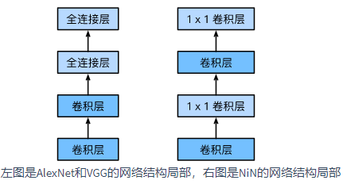
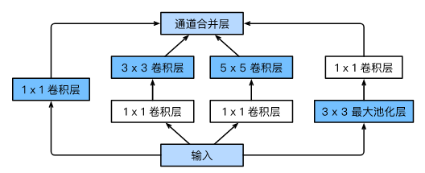
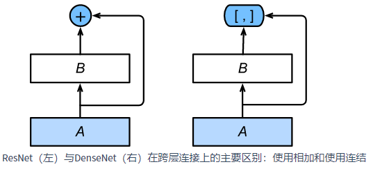

==================
经典卷积模型
==================

LeNet模型
######################

- 它是早期用来识别手写数字图像的卷积神经网络。这个名字来源于LeNet论文的第一作者Yann LeCun。LeNet展示了通过梯度下降训练卷积神经网络可以达到手写数字识别在当时最先进的结果。这个奠基性的工作第一次将卷积神经网络推上舞台，为世人所知。LeNet的网络结构如下图所示。

.. image:: ./cnnModels.assets/lenet_20200322145155.png
    :alt:
    :align: center

- LeNet分为卷积层块和全连接层块两个部分。使用sigmoid激活函数。参数量： ``total:44.426 Thousand, trainable:44.426 Thousand`` ,模型结构：

.. code:: python

    class LeNet(nn.Module):
        """早期用来识别手写数字图像的卷积神经网络"""
        def __init__(self):
            super().__init__()
            self.conv = nn.Sequential(
                nn.Conv2d(1, 6, 5),  # in_channels, out_channels, kernel_size
                nn.Sigmoid(),
                nn.MaxPool2d(2, 2),  # kernel_size, stride
                nn.Conv2d(6, 16, 5),
                nn.Sigmoid(),
                nn.MaxPool2d(2, 2))
            # input_shape = (64, 1, 28, 28)  # 批量大小, 通道, 高, 宽
            self.fc = nn.Sequential(
                nn.Linear(16 * 4 * 4, 120),
                nn.Sigmoid(),
                nn.Linear(120, 84),
                nn.Sigmoid(),
                nn.Linear(84, 10))

        def forward(self, img):
            feature = self.conv(img)
            output = self.fc(feature.view(img.shape[0], -1))
            return output

- 卷积层输出形状计算：

.. code:: python

    """
    input_shape:(64, 1, 28, 28)
    layer:1 conv:(1, 6, 5), output_shape:(64, 6, 24, 24)
    layer:2 maxpool:(2, 2), output_shape:(64, 6, 12, 12)
    layer:3 conv:(6, 16, 5), output_shape:(64, 16, 8, 8)
    layer:4 maxpool:(2, 2), output_shape:(64, 16, 4, 4)
    output_shape:(64, 16, 4, 4)
    """

- 参考文献：LeCun, Y., Bottou, L., Bengio, Y., & Haffner, P. (1998). Gradient-based learning applied to document recognition. Proceedings of the IEEE, 86(11), 2278-2324.

AlexNet模型
######################

- 这个模型的名字来源于论文第一作者的姓名Alex Krizhevsky。AlexNet使用了8层卷积神经网络，并以很大的优势赢得了ImageNet 2012图像识别挑战赛。它首次证明了学习到的特征可以超越手工设计的特征，从而一举打破计算机视觉研究的前状。

.. image:: ./cnnModels.assets/alexnet_20200322161945.png
    :alt:
    :align: center

- 1、与相对较小的LeNet相比，AlexNet包含8层变换，其中有5层卷积和2层全连接隐藏层，以及1个全连接输出层。
- 2、AlexNet将sigmoid激活函数改成了更加简单的ReLU激活函数。
- 3、AlexNet通过丢弃法来控制全连接层的模型复杂度。
- 4、AlexNet引入了大量的图像增广，如翻转、裁剪和颜色变化，从而进一步扩大数据集来缓解过拟合。
- 简化后的模型结构如下图，参数数量 ``total:46.765 Million, trainable:46.765 Million`` :

.. code:: python

    class AlexNet(nn.Module):
        """简化的AlexNet"""
        def __init__(self):
            super().__init__()
            self.conv = nn.Sequential(
                nn.Conv2d(1, 96, 11, 4),  # in_channels, out_channels, kernel_size, stride, padding
                nn.ReLU(),
                nn.MaxPool2d(3, 2),  # kernel_size, stride
                # 减小卷积窗口，使用填充为2来使得输入与输出的高和宽一致，且增大输出通道数
                nn.Conv2d(96, 256, 5, 1, 2),
                nn.ReLU(),
                nn.MaxPool2d(3, 2),
                # 连续3个卷积层，且使用更小的卷积窗口。除了最后的卷积层外，进一步增大了输出通道数。
                # 前两个卷积层后不使用池化层来减小输入的高和宽
                nn.Conv2d(256, 384, 3, 1, 1),
                nn.ReLU(),
                nn.Conv2d(384, 384, 3, 1, 1),
                nn.ReLU(),
                nn.Conv2d(384, 256, 3, 1, 1),
                nn.ReLU(),
                nn.MaxPool2d(3, 2)
            )
            # input_shape = (64, 1, 224, 224)  # 批量大小, 通道, 高, 宽
            # 这里全连接层的输出个数比LeNet中的大数倍。使用丢弃层来缓解过拟合
            self.fc = nn.Sequential(
                nn.Linear(256*5*5, 4096),
                nn.ReLU(),
                nn.Dropout(0.5),
                nn.Linear(4096, 4096),
                nn.ReLU(),
                nn.Dropout(0.5),
                # 输出层。由于这里使用Fashion-MNIST，所以用类别数为10，而非论文中的1000
                nn.Linear(4096, 10),
            )

        def forward(self, img):
            feature = self.conv(img)
            output = self.fc(feature.view(img.shape[0], -1))
            return output

- 卷积层输出形状计算：

.. code:: python

    """
    input_shape:(64, 1, 224, 224)
    layer:1 conv:(1, 96, 11, 4), output_shape:(64, 96, 54, 54)
    layer:2 maxpool:(3, 2), output_shape:(64, 96, 26, 26)
    layer:3 conv:(96, 256, 5, 1, 2), output_shape:(64, 256, 26, 26)
    layer:4 maxpool:(3, 2), output_shape:(64, 256, 12, 12)
    layer:5 conv:(256, 384, 3, 1, 1), output_shape:(64, 384, 12, 12)
    layer:6 conv:(2384, 384, 3, 1, 1), output_shape:(64, 384, 12, 12)
    layer:7 conv:(2384, 256, 3, 1, 1), output_shape:(64, 256, 12, 12)
    layer:8 maxpool:(3, 2), output_shape:(64, 256, 5, 5)
    output_shape:(64, 256, 5, 5)
    """

- 参考文献：Krizhevsky, A., Sutskever, I., & Hinton, G. E. (2012). Imagenet classification with deep convolutional neural networks. In Advances in neural information processing systems (pp. 1097-1105).

VGG模型
######################

- VGG，它的名字来源于论文作者所在的实验室Visual Geometry Group。VGG提出了可以通过 **重复使用简单的基础块** 来构建深度模型的思路。
- **VGG块** 的组成规律是：连续使用数个相同的填充为1、窗口形状为 :math:`3\times 3` 的卷积层后接上一个步幅为2、窗口形状为 :math:`2\times 2` 的最大池化层。卷积层保持输入的高和宽不变，而池化层则对其减半。 *对于给定的感受野（与输出有关的输入图片的局部大小），采用堆积的小卷积核优于采用大的卷积核，因为可以增加网络深度来保证学习更复杂的模式，而且代价还比较小（参数更少）* 。

.. code:: python

    def vgg_block(num_convs, in_channels, out_channels):
        blk = []
        for i in range(num_convs):
            if i == 0:
                blk.append(nn.Conv2d(in_channels, out_channels, kernel_size=3, padding=1))
            else:
                blk.append(nn.Conv2d(out_channels, out_channels, kernel_size=3, padding=1))
            blk.append(nn.ReLU())
        blk.append(nn.MaxPool2d(kernel_size=2, stride=2)) # 这里会使宽高减半
        return nn.Sequential(*blk)

- 与AlexNet和LeNet一样，VGG网络由卷积层模块后接全连接层模块构成。卷积层模块串联数个vgg_block，其超参数由变量conv_arch定义。该变量指定了每个VGG块里卷积层个数和输入输出通道数。全连接模块则跟AlexNet中的一样。下面为使用了8个卷积层和3个全连接层的网络，所以经常被称为VGG-11。参数量： ``total:128.806 Million, trainable:128.806 Million``

.. code:: python

    class VGG11(nn.Module):
        """VGG-11：通过重复使用简单的基础块来构建深度模型"""
        def __init__(self):
            super().__init__()
            conv_arch = ((1, 1, 64), (1, 64, 128), (2, 128, 256), (2, 256, 512), (2, 512, 512))
            # ratio = 8
            # small_conv_arch = [(1, 1, 64//ratio), (1, 64//ratio, 128//ratio), (2, 128//ratio, 256//ratio), 
            #            (2, 256//ratio, 512//ratio), (2, 512//ratio, 512//ratio)]
            # 经过5个vgg_block, 宽高会减半5次, 变成 224/32 = 7
            fc_features = 512 * 7 * 7  # c * w * h
            fc_hidden_units = 4096  # 任意
            # 定义VGG网络
            # 卷积层部分
            self.conv = nn.Sequential()
            for i, (num_convs, in_channels, out_channels) in enumerate(conv_arch):
                # 每经过一个vgg_block都会使宽高减半
                self.conv.add_module("vgg_block_" + str(i+1), self._vgg_block(num_convs, in_channels, out_channels))
            # 全连接层部分
            # 输入形状：1, 1, 224, 224
            self.fc = nn.Sequential(
                nn.Linear(fc_features, fc_hidden_units),
                nn.ReLU(),
                nn.Dropout(0.5),
                nn.Linear(fc_hidden_units, fc_hidden_units),
                nn.ReLU(),
                nn.Dropout(0.5),
                nn.Linear(fc_hidden_units, 10)
            )

        def _vgg_block(self, num_convs, in_channels, out_channels):
            """VGG块"""
            blk = []
            for i in range(num_convs):
                if i == 0:
                    blk.append(nn.Conv2d(in_channels, out_channels, kernel_size=3, padding=1))
                else:
                    blk.append(nn.Conv2d(out_channels, out_channels, kernel_size=3, padding=1))
                blk.append(nn.ReLU())
            blk.append(nn.MaxPool2d(kernel_size=2, stride=2))  # 这里会使宽高减半
            return nn.Sequential(*blk)

        def forward(self, img):
            feature = self.conv(img)
            output = self.fc(feature.view(img.shape[0], -1))
            return output

- 参考文献：Simonyan, K., & Zisserman, A. (2014). Very deep convolutional networks for large-scale image recognition. arXiv preprint arXiv:1409.1556.

NIN模型
######################

- 网络中的网络（NiN）。它提出了另外一个思路，即串联多个由卷积层和“全连接”层构成的小网络来构建一个深层网络。
- 卷积层的输入和输出通常是 **四维数组（样本，通道，高，宽）** ，而全连接层的输入和输出则通常是 **二维数组（样本，特征）** 。如果想在全连接层后再接上卷积层，则需要将全连接层的输出变换为四维。 :math:`1\times 1` 卷积层可以看成全连接层，其中空间维度（高和宽）上的每个元素相当于样本，通道相当于特征。因此，NiN使用 :math:`1\times 1` 卷积层来替代全连接层，从而使空间信息能够自然传递到后面的层中去。下对比了NiN同AlexNet和VGG等网络在结构上的主要区别。

- NiN块是NiN中的基础块。它由一个卷积层加两个充当全连接层的 :math:`1\times 1` 卷积层串联而成。其中第一个卷积层的超参数可以自行设置，而第二和第三个卷积层的超参数一般是固定的。

.. code:: python

    def nin_block(in_channels, out_channels, kernel_size, stride, padding):
        blk = nn.Sequential(nn.Conv2d(in_channels, out_channels, kernel_size, stride, padding),
                            nn.ReLU(),
                            nn.Conv2d(out_channels, out_channels, kernel_size=1),
                            nn.ReLU(),
                            nn.Conv2d(out_channels, out_channels, kernel_size=1),
                            nn.ReLU())
        return blk

- 除使用NiN块以外，NiN还有一个设计与AlexNet显著不同：NiN去掉了AlexNet最后的3个全连接层，取而代之地，NiN使用了输出通道数等于标签类别数的NiN块，然后使用全局平均池化层对每个通道中所有元素求平均并直接用于分类。这里的全局平均池化层即窗口形状等于输入空间维形状的平均池化层。NiN的这个设计的好处是可以显著减小模型参数尺寸，从而缓解过拟合。然而，该设计有时会造成获得有效模型的训练时间的增加。参数数量： ``1.992 Million, trainable:1.992 Million``

.. code:: python

    class NiN(nn.Module):
        """串联多个由卷积层和“全连接”层构成的小网络来构建一个深层网络"""
        def __init__(self):
            super().__init__()
            # 输出形状：1, 1, 224, 224
            self.net = nn.Sequential(
                self._nin_block(1, 96, kernel_size=11, stride=4, padding=0),
                nn.MaxPool2d(kernel_size=3, stride=2),
                self._nin_block(96, 256, kernel_size=5, stride=1, padding=2),
                nn.MaxPool2d(kernel_size=3, stride=2),
                self._nin_block(256, 384, kernel_size=3, stride=1, padding=1),
                nn.MaxPool2d(kernel_size=3, stride=2),
                nn.Dropout(0.5),
                # 标签类别数是10
                self._nin_block(384, 10, kernel_size=3, stride=1, padding=1),
                GlobalAvgPool2d(),
                # 将四维的输出转成二维的输出，其形状为(批量大小, 10)
                FlattenLayer())

        def _nin_block(self, in_channels, out_channels, kernel_size, stride, padding):
            """NiN块"""
            blk = nn.Sequential(nn.Conv2d(in_channels, out_channels, kernel_size, stride, padding),
                                nn.ReLU(),
                                nn.Conv2d(out_channels, out_channels, kernel_size=1),
                                nn.ReLU(),
                                nn.Conv2d(out_channels, out_channels, kernel_size=1),
                                nn.ReLU())
            return blk

        def forward(self, img):
            output = self.net(img)
            return output

- 参考文献：Lin, M., Chen, Q., & Yan, S. (2013). Network in network. arXiv preprint arXiv:1312.4400.

GoogLeNet模型
######################

- 在2014年的ImageNet图像识别挑战赛中，一个名叫GoogLeNet的网络结构大放异彩。GoogLeNet吸收了NiN中网络串联网络的思想，并在此基础上做了很大改进。
- **Inception块** GoogLeNet中的基础卷积块叫作Inception块，得名于同名电影《盗梦空间》（Inception）。与上一节介绍的NiN块相比，这个基础块在结构上更加复杂，如下图所示。

- 由上图可以看出，Inception块里有4条并行的线路。前3条线路使用窗口大小分别是 :math:`1\times 1` 、 :math:`3\times 3` 和 :math:`5\times 5` 的卷积层来抽取不同空间尺寸下的信息，其中中间2个线路会对输入先做 :math:`1\times 1` 卷积来减少输入通道数，以降低模型复杂度。第四条线路则使用 :math:`3\times 3` 最大池化层，后接 :math:`1\times 1` 卷积层来改变通道数。4条线路都使用了合适的填充来使输入与输出的高和宽一致。最后我们将每条线路的输出在通道维上连结，并输入接下来的层中去。Inception块中可以自定义的超参数是每个层的输出通道数，我们以此来控制模型复杂度。

.. code-block:: python

    class Inception(nn.Module):
        """GoogLeNet中的基础卷积块Inception块"""
        # c1 - c4为每条线路里的层的输出通道数
        def __init__(self, in_c, c1, c2, c3, c4):
            super(Inception, self).__init__()
            # 线路1，单1 x 1卷积层
            self.p1_1 = nn.Conv2d(in_c, c1, kernel_size=1)
            # 线路2，1 x 1卷积层后接3 x 3卷积层
            self.p2_1 = nn.Conv2d(in_c, c2[0], kernel_size=1)
            self.p2_2 = nn.Conv2d(c2[0], c2[1], kernel_size=3, padding=1)
            # 线路3，1 x 1卷积层后接5 x 5卷积层
            self.p3_1 = nn.Conv2d(in_c, c3[0], kernel_size=1)
            self.p3_2 = nn.Conv2d(c3[0], c3[1], kernel_size=5, padding=2)
            # 线路4，3 x 3最大池化层后接1 x 1卷积层
            self.p4_1 = nn.MaxPool2d(kernel_size=3, stride=1, padding=1)
            self.p4_2 = nn.Conv2d(in_c, c4, kernel_size=1)

        def forward(self, x):
            p1 = F.relu(self.p1_1(x))
            p2 = F.relu(self.p2_2(F.relu(self.p2_1(x))))
            p3 = F.relu(self.p3_2(F.relu(self.p3_1(x))))
            p4 = F.relu(self.p4_2(self.p4_1(x)))
            return torch.cat((p1, p2, p3, p4), dim=1)  # 在通道维上连结输出

- GoogLeNet跟VGG一样，在主体卷积部分中使用5个模块（block），每个模块之间使用步幅为2的 :math:`3\times 3` 最大池化层来减小输出高宽。参数量： ``total:5.978 Million, trainable:5.978 Million``

.. code-block:: python

    class GoogLeNet(nn.Module):
        """GoogLeNet模型"""
        def __init__(self):
            super().__init__()
            # 第一模块使用一个64通道的7×7卷积层。
            b1 = nn.Sequential(
                nn.Conv2d(1, 64, kernel_size=7, stride=2, padding=3),
                nn.ReLU(),
                nn.MaxPool2d(kernel_size=3, stride=2, padding=1))
            # 第二模块使用2个卷积层：首先是64通道的1×1卷积层，然后是将通道增大3倍的3×3卷积层。它对应Inception块中的第二条线路。
            b2 = nn.Sequential(
                nn.Conv2d(64, 64, kernel_size=1),
                nn.Conv2d(64, 192, kernel_size=3, padding=1),
                nn.MaxPool2d(kernel_size=3, stride=2, padding=1))
            # 第三模块串联2个完整的Inception块。第一个Inception块的输出通道数为64+128+32+32=256，其中4条线路的输出通道数比例为12832:32=241:164:128:32:32=2:4:1:1。其中第二、第三条线路先分别将输入通道数减小至96/192=1/2和16/192=1/12后，再接上第二层卷积层。第二个Inception块输出通道数增至128+192+96+64=480，每条线路的输出通道数之比为19296:64 = 463:2128:192:96:64=4:6:3:2。其中第二、第三条线路先分别将输入通道数减小至128/256=1/2和32/256=1/8。
            b3 = nn.Sequential(
                Inception(192, 64, (96, 128), (16, 32), 32),
                Inception(256, 128, (128, 192), (32, 96), 64),
                nn.MaxPool2d(kernel_size=3, stride=2, padding=1))
            # 第四模块更加复杂。它串联了5个Inception块，其输出通道数分别是192+208+48+64=512、160+224+64+64=512、128+256+64+64=512、112+288+64+64=528和256+320+128+128=832。这些线路的通道数分配和第三模块中的类似，首先含3×3卷积层的第二条线路输出最多通道，其次是仅含1×1卷积层的第一条线路，之后是含5×5卷积层的第三条线路和含3×3最大池化层的第四条线路。其中第二、第三条线路都会先按比例减小通道数。这些比例在各个Inception块中都略有不同。
            b4 = nn.Sequential(
                Inception(480, 192, (96, 208), (16, 48), 64),
                Inception(512, 160, (112, 224), (24, 64), 64),
                Inception(512, 128, (128, 256), (24, 64), 64),
                Inception(512, 112, (144, 288), (32, 64), 64),
                Inception(528, 256, (160, 320), (32, 128), 128),
                nn.MaxPool2d(kernel_size=3, stride=2, padding=1))
            # 第五模块有输出通道数为256+320+128+128=832和384+384+128+128=1024的两个Inception块。其中每条线路的通道数的分配思路和第三、第四模块中的一致，只是在具体数值上有所不同。需要注意的是，第五模块的后面紧跟输出层，该模块同NiN一样使用全局平均池化层来将每个通道的高和宽变成1。最后我们将输出变成二维数组后接上一个输出个数为标签类别数的全连接层。
            b5 = nn.Sequential(
                Inception(832, 256, (160, 320), (32, 128), 128),
                Inception(832, 384, (192, 384), (48, 128), 128),
                GlobalAvgPool2d())
            self.net = nn.Sequential(
                b1,
                b2,
                b3,
                b4,
                b5,
                FlattenLayer(),
                nn.Linear(1024, 10))

        def forward(self, img):
            output = self.net(img)
            return output

- GoogLeNet模型的计算复杂，而且不如VGG那样便于修改通道数。GoogLeNet将多个设计精细的Inception块和其他层串联起来。其中Inception块的通道数分配之比是在ImageNet数据集上通过大量的实验得来的。GoogLeNet和它的后继者们一度是ImageNet上最高效的模型之一：在类似的测试精度下，它们的计算复杂度往往更低。
- Inception块相当于一个有4条线路的子网络。它通过不同窗口形状的卷积层和最大池化层来并行抽取信息，并使用 :math:`1\times 1` 卷积层减少通道数从而降低模型复杂度。
- 参考文献：Szegedy, C., Ioffe, S., Vanhoucke, V., & Alemi, A. A. (2017, February). Inception-v4, inception-resnet and the impact of residual connections on learning. In Proceedings of the AAAI Conference on Artificial Intelligence (Vol. 4, p. 12).

ResNet模型
######################

- 在实践中，添加过多的层后训练误差往往不降反升。针对这一问题，何恺明等人提出了残差网络（ResNet）。它在2015年的ImageNet图像识别挑战赛夺魁，并深刻影响了后来的深度神经网络的设计。
- 残差块通过 **跨层的数据通道** 从而能够训练出有效的深度神经网络。
- **残差块** 如下图所示，设输入为 :math:`\boldsymbol{x}` 。假设我们希望学出的理想映射为 :math:`f(\boldsymbol{x})` ，从而作为下图上方激活函数的输入。左图虚线框中的部分需要直接拟合出该映射 :math:`f(\boldsymbol{x})` ，而右图虚线框中的部分则需要拟合出有关恒等映射的残差映射 :math:`f(\boldsymbol{x})-\boldsymbol{x}` 。残差映射在实际中往往更容易优化。以本节开头提到的恒等映射作为我们希望学出的理想映射 :math:`f(\boldsymbol{x})` 。我们只需将下图中右图虚线框内上方的加权运算（如仿射）的权重和偏差参数学成0，那么 :math:`f(\boldsymbol{x})` 即为恒等映射。实际中，当理想映射 :math:`f(\boldsymbol{x})` 极接近于恒等映射时，残差映射也易于捕捉恒等映射的细微波动。下图右图也是ResNet的基础块，即残差块（residual block）。在残差块中，输入可通过跨层的数据线路更快地向前传播。

.. image:: ./cnnModels.assets/resnet_block_20200325224906.png
    :alt:
    :align: center

- ResNet沿用了VGG全 :math:`3\times 3` 卷积层的设计。残差块里首先有2个有相同输出通道数的 :math:`3\times 3` 卷积层。每个卷积层后接一个批量归一化层和ReLU激活函数。然后我们将输入跳过这两个卷积运算后直接加在最后的ReLU激活函数前。这样的设计要求两个卷积层的输出与输入形状一样，从而可以相加。如果想改变通道数，就需要引入一个额外的 :math:`1\times 1` 卷积层来将输入变换成需要的形状后再做相加运算。残差块的实现如下。

.. code-block:: python

    class Residual(nn.Module):
        def __init__(self, in_channels, out_channels, use_1x1conv=False, stride=1):
            super(Residual, self).__init__()
            self.conv1 = nn.Conv2d(in_channels, out_channels, kernel_size=3, padding=1, stride=stride)
            self.conv2 = nn.Conv2d(out_channels, out_channels, kernel_size=3, padding=1)
            if use_1x1conv:
                self.conv3 = nn.Conv2d(in_channels, out_channels, kernel_size=1, stride=stride)
            else:
                self.conv3 = None
            self.bn1 = nn.BatchNorm2d(out_channels)
            self.bn2 = nn.BatchNorm2d(out_channels)

        def forward(self, X):
            Y = F.relu(self.bn1(self.conv1(X)))
            Y = self.bn2(self.conv2(Y))
            if self.conv3:
                X = self.conv3(X)
            return F.relu(Y + X)

- 模型结构如下。参数量 ``total:11.178 Million, trainable:11.178 Million``

.. code-block:: python

    class ResNet18(nn.Module):
        """残差模型,卷积层和最后的全连接层，共计18层,通常也被称为ResNet-18"""
        def __init__(self):
            super().__init__()
            self.net = nn.Sequential(
                nn.Conv2d(1, 64, kernel_size=7, stride=2, padding=3),
                nn.BatchNorm2d(64),
                nn.ReLU(),
                nn.MaxPool2d(kernel_size=3, stride=2, padding=1))
            # 残差块,每个模块使用两个残差块
            self.net.add_module("resnet_block1", self._resnet_block(64, 64, 2, first_block=True))
            self.net.add_module("resnet_block2", self._resnet_block(64, 128, 2))
            self.net.add_module("resnet_block3", self._resnet_block(128, 256, 2))
            self.net.add_module("resnet_block4", self._resnet_block(256, 512, 2))
            # 全连接层
            self.net.add_module("global_avg_pool", GlobalAvgPool2d())  # GlobalAvgPool2d的输出: (Batch, 512, 1, 1)
            self.net.add_module("fc", nn.Sequential(FlattenLayer(), nn.Linear(512, 10)))

        def _resnet_block(self, in_channels, out_channels, num_residuals, first_block=False):
            """使用若干个同样输出通道数的残差块。第一个模块的通道数同输入通道数一致。由于之前已经使用了步幅为2的最大池化层，所以无须减小高和宽。之后的每个模块在第一个残差块里将上一个模块的通道数翻倍，并将高和宽减半。"""
            if first_block:
                assert in_channels == out_channels  # 第一个模块的通道数同输入通道数一致
            blk = []
            for i in range(num_residuals):
                if i == 0 and not first_block:
                    blk.append(Residual(in_channels, out_channels, use_1x1conv=True, stride=2))
                else:
                    blk.append(Residual(out_channels, out_channels))
            return nn.Sequential(*blk)

        def forward(self, img):
            output = self.net(img)
            return output

- 参考文献:He, K., Zhang, X., Ren, S., & Sun, J. (2016). Deep residual learning for image recognition. In Proceedings of the IEEE conference on computer vision and pattern recognition (pp. 770-778).
- 参考文献:He, K., Zhang, X., Ren, S., & Sun, J. (2016, October). Identity mappings in deep residual networks. In European Conference on Computer Vision (pp. 630-645). Springer, Cham.

DenseNet模型
######################

- 稠密连接网络（DenseNet）。它与ResNet的主要区别如图：

- 上图中将部分前后相邻的运算抽象为模块为A和模块为B。与ResNet的主要区别在于，DenseNet里模块为B的输出不是像ResNet那样和模块为A的输出相加，而是 **在通道维上连结** 。这样模块A的输出可以直接传入模块B后面的层。在这个设计里， *模块A直接跟模块B后面的所有层连接在了一起* 。这也是它被称为“稠密连接”的原因。
- DenseNet的主要构建模块是稠密块（dense block）和过渡层（transition layer）。前者定义了输入和输出是如何连结的，后者则用来控制通道数，使之不过大。
- **稠密块** DenseNet使用了ResNet改良版的“批量归一化、激活和卷积”结构。稠密块由多个conv_block组成，每块使用相同的输出通道数。卷积块的通道数控制了输出通道数相对于输入通道数的增长，因此也被称为增长率（growth rate）。当有2个输出通道数为10的卷积块。使用通道数为3的输入时，我们会得到通道数为 :math:`3+2\times 10=23` 的输出。

.. code-block:: python

    class DenseBlock(nn.Module):
        """稠密块"""
        def __init__(self, num_convs, in_channels, out_channels):
            super().__init__()
            net = []
            for i in range(num_convs):
                in_c = in_channels + i * out_channels
                net.append(self._conv_block(in_c, out_channels))
            self.net = nn.ModuleList(net)
            self.out_channels = in_channels + num_convs * out_channels  # 计算输出通道数

        def _conv_block(self, in_channels, out_channels):
            blk = nn.Sequential(nn.BatchNorm2d(in_channels), 
                                nn.ReLU(),
                                nn.Conv2d(in_channels, out_channels, kernel_size=3, padding=1))
            return blk

        def forward(self, X):
            for blk in self.net:
                Y = blk(X)
                X = torch.cat((X, Y), dim=1)  # 在通道维上将输入和输出连结
            return X

- **过渡层** 由于每个稠密块都会带来通道数的增加，使用过多则会带来过于复杂的模型。过渡层用来控制模型复杂度。它通过 :math:`1\times1` 卷积层来减小通道数，并使用步幅为2的平均池化层减半高和宽，从而进一步降低模型复杂度。

.. code-block:: python

    def transition_block(in_channels, out_channels):
        blk = nn.Sequential(
                nn.BatchNorm2d(in_channels), 
                nn.ReLU(),
                nn.Conv2d(in_channels, out_channels, kernel_size=1),
                nn.AvgPool2d(kernel_size=2, stride=2))
        return blk

- DenseNet模型:在跨层连接上，不同于ResNet中将输入与输出相加，DenseNet在通道维上连结输入与输出。参数量: ``total:758.226 Thousand, trainable:758.226 Thousand``

.. code-block:: python

    class DenseNet(nn.Module):
        """稠密网络模型"""
        def __init__(self):
            super().__init__()
            # 首先使用同ResNet一样的单卷积层和最大池化层
            self.net = nn.Sequential(
                nn.Conv2d(1, 64, kernel_size=7, stride=2, padding=3),
                nn.BatchNorm2d(64),
                nn.ReLU(),
                nn.MaxPool2d(kernel_size=3, stride=2, padding=1))
            # 类似于ResNet接下来使用的4个残差块，DenseNet使用的是4个稠密块
            # 稠密块里的卷积层通道数（即增长率）设为32，所以每个稠密块将增加128个通道
            num_channels, growth_rate = 64, 32  # num_channels为当前的通道数
            num_convs_in_dense_blocks = [4, 4, 4, 4]
            for i, num_convs in enumerate(num_convs_in_dense_blocks):
                DB = DenseBlock(num_convs, num_channels, growth_rate)
                self.net.add_module("DenseBlosk_%d" % i, DB)
                # 上一个稠密块的输出通道数
                num_channels = DB.out_channels
                # 在稠密块之间加入通道数减半的过渡层
                if i != len(num_convs_in_dense_blocks) - 1:
                    self.net.add_module("transition_block_%d" % i, self._transition_block(num_channels, num_channels // 2))
                    num_channels = num_channels // 2
            # 最后接上全局池化层和全连接层来输出
            self.net.add_module("BN", nn.BatchNorm2d(num_channels))
            self.net.add_module("relu", nn.ReLU())
            self.net.add_module("global_avg_pool", GlobalAvgPool2d())  # GlobalAvgPool2d的输出: (Batch, num_channels, 1, 1)
            self.net.add_module("fc", nn.Sequential(FlattenLayer(), nn.Linear(num_channels, 10)))

        def _transition_block(self, in_channels, out_channels):
            """过渡层,过渡层用来控制模型复杂度。它通过1×1卷积层来减小通道数，并使用步幅为2的平均池化层减半高和宽，从而进一步降低模型复杂度。"""
            blk = nn.Sequential(
                    nn.BatchNorm2d(in_channels),
                    nn.ReLU(),
                    nn.Conv2d(in_channels, out_channels, kernel_size=1),
                    nn.AvgPool2d(kernel_size=2, stride=2))
            return blk

        def forward(self, img):
            output = self.net(img)
            return output

- 参考文献：Huang, G., Liu, Z., Weinberger, K. Q., & van der Maaten, L. (2017). Densely connected convolutional networks. In Proceedings of the IEEE conference on computer vision and pattern recognition (Vol. 1, No. 2).