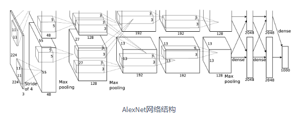

==================
经典卷积模型
==================

LeNet模型
######################

- 它是早期用来识别手写数字图像的卷积神经网络。这个名字来源于LeNet论文的第一作者Yann LeCun。LeNet展示了通过梯度下降训练卷积神经网络可以达到手写数字识别在当时最先进的结果。这个奠基性的工作第一次将卷积神经网络推上舞台，为世人所知。LeNet的网络结构如下图所示。

.. image:: ./cnnModels.assets/lenet_20200322145155.png
    :alt:
    :align: center

- LeNet分为卷积层块和全连接层块两个部分。使用sigmoid激活函数。参数量： ``total: 44426, trainable: 44426`` ,模型结构：

.. code:: python

	class LeNet(nn.Module):
	    """早期用来识别手写数字图像的卷积神经网络"""
	    def __init__(self):
	        super().__init__()
	        self.conv = nn.Sequential(
	            nn.Conv2d(1, 6, 5),  # in_channels, out_channels, kernel_size
	            nn.Sigmoid(),
	            nn.MaxPool2d(2, 2),  # kernel_size, stride
	            nn.Conv2d(6, 16, 5),
	            nn.Sigmoid(),
	            nn.MaxPool2d(2, 2))
	        # input_shape = (64, 1, 28, 28)  # 批量大小, 通道, 高, 宽
	        self.fc = nn.Sequential(
	            nn.Linear(16 * 4 * 4, 120),
	            nn.Sigmoid(),
	            nn.Linear(120, 84),
	            nn.Sigmoid(),
	            nn.Linear(84, 10))

	    def forward(self, img):
	        feature = self.conv(img)
	        output = self.fc(feature.view(img.shape[0], -1))
	        return output

- 卷积层输出形状计算：

.. code:: python

    """
    input_shape:(64, 1, 28, 28)
    layer:1 conv:(1, 6, 5), output_shape:(64, 6, 24, 24)
    layer:2 maxpool:(2, 2), output_shape:(64, 6, 12, 12)
    layer:3 conv:(6, 16, 5), output_shape:(64, 16, 8, 8)
    layer:4 maxpool:(2, 2), output_shape:(64, 16, 4, 4)
    output_shape:(64, 16, 4, 4)
    """

- 参考文献：LeCun, Y., Bottou, L., Bengio, Y., & Haffner, P. (1998). Gradient-based learning applied to document recognition. Proceedings of the IEEE, 86(11), 2278-2324.

AlexNet模型
######################

- 这个模型的名字来源于论文第一作者的姓名Alex Krizhevsky。AlexNet使用了8层卷积神经网络，并以很大的优势赢得了ImageNet 2012图像识别挑战赛。它首次证明了学习到的特征可以超越手工设计的特征，从而一举打破计算机视觉研究的前状。

- 1、与相对较小的LeNet相比，AlexNet包含8层变换，其中有5层卷积和2层全连接隐藏层，以及1个全连接输出层。
- 2、AlexNet将sigmoid激活函数改成了更加简单的ReLU激活函数。
- 3、AlexNet通过丢弃法来控制全连接层的模型复杂度。
- 4、AlexNet引入了大量的图像增广，如翻转、裁剪和颜色变化，从而进一步扩大数据集来缓解过拟合。
- 简化后的模型结构如下图，参数数量 ``total: 46764746, trainable: 46764746`` :

.. code:: python

    class AlexNet(nn.Module):
	    """简化的AlexNet"""
	    def __init__(self):
	        super().__init__()
	        self.conv = nn.Sequential(
	            nn.Conv2d(1, 96, 11, 4),  # in_channels, out_channels, kernel_size, stride, padding
	            nn.ReLU(),
	            nn.MaxPool2d(3, 2),  # kernel_size, stride
	            # 减小卷积窗口，使用填充为2来使得输入与输出的高和宽一致，且增大输出通道数
	            nn.Conv2d(96, 256, 5, 1, 2),
	            nn.ReLU(),
	            nn.MaxPool2d(3, 2),
	            # 连续3个卷积层，且使用更小的卷积窗口。除了最后的卷积层外，进一步增大了输出通道数。
	            # 前两个卷积层后不使用池化层来减小输入的高和宽
	            nn.Conv2d(256, 384, 3, 1, 1),
	            nn.ReLU(),
	            nn.Conv2d(384, 384, 3, 1, 1),
	            nn.ReLU(),
	            nn.Conv2d(384, 256, 3, 1, 1),
	            nn.ReLU(),
	            nn.MaxPool2d(3, 2)
	        )
	        # input_shape = (64, 1, 224, 224)  # 批量大小, 通道, 高, 宽
	        # 这里全连接层的输出个数比LeNet中的大数倍。使用丢弃层来缓解过拟合
	        self.fc = nn.Sequential(
	            nn.Linear(256*5*5, 4096),
	            nn.ReLU(),
	            nn.Dropout(0.5),
	            nn.Linear(4096, 4096),
	            nn.ReLU(),
	            nn.Dropout(0.5),
	            # 输出层。由于这里使用Fashion-MNIST，所以用类别数为10，而非论文中的1000
	            nn.Linear(4096, 10),
	        )

	    def forward(self, img):
	        feature = self.conv(img)
	        output = self.fc(feature.view(img.shape[0], -1))
	        return output

- 卷积层输出形状计算：

.. code:: python

    """
    input_shape:(64, 1, 224, 224)
    layer:1 conv:(1, 96, 11, 4), output_shape:(64, 96, 54, 54)
    layer:2 maxpool:(3, 2), output_shape:(64, 96, 26, 26)
    layer:3 conv:(96, 256, 5, 1, 2), output_shape:(64, 256, 26, 26)
    layer:4 maxpool:(3, 2), output_shape:(64, 256, 12, 12)
    layer:5 conv:(256, 384, 3, 1, 1), output_shape:(64, 384, 12, 12)
    layer:6 conv:(2384, 384, 3, 1, 1), output_shape:(64, 384, 12, 12)
    layer:7 conv:(2384, 256, 3, 1, 1), output_shape:(64, 256, 12, 12)
    layer:8 maxpool:(3, 2), output_shape:(64, 256, 5, 5)
    output_shape:(64, 256, 5, 5)
    """

- 参考文献：Krizhevsky, A., Sutskever, I., & Hinton, G. E. (2012). Imagenet classification with deep convolutional neural networks. In Advances in neural information processing systems (pp. 1097-1105).

VGG模型
######################

- VGG，它的名字来源于论文作者所在的实验室Visual Geometry Group。VGG提出了可以通过 **重复使用简单的基础块** 来构建深度模型的思路。
- **VGG块** 的组成规律是：连续使用数个相同的填充为1、窗口形状为 :math:`3\times 3` 的卷积层后接上一个步幅为2、窗口形状为 :math:`2\times 2` 的最大池化层。卷积层保持输入的高和宽不变，而池化层则对其减半。 *对于给定的感受野（与输出有关的输入图片的局部大小），采用堆积的小卷积核优于采用大的卷积核，因为可以增加网络深度来保证学习更复杂的模式，而且代价还比较小（参数更少）* 。

.. code:: python

    def vgg_block(num_convs, in_channels, out_channels):
	    blk = []
	    for i in range(num_convs):
	        if i == 0:
	            blk.append(nn.Conv2d(in_channels, out_channels, kernel_size=3, padding=1))
	        else:
	            blk.append(nn.Conv2d(out_channels, out_channels, kernel_size=3, padding=1))
	        blk.append(nn.ReLU())
	    blk.append(nn.MaxPool2d(kernel_size=2, stride=2)) # 这里会使宽高减半
	    return nn.Sequential(*blk)

- 与AlexNet和LeNet一样，VGG网络由卷积层模块后接全连接层模块构成。卷积层模块串联数个vgg_block，其超参数由变量conv_arch定义。该变量指定了每个VGG块里卷积层个数和输入输出通道数。全连接模块则跟AlexNet中的一样。下面为使用了8个卷积层和3个全连接层的网络，所以经常被称为VGG-11。参数量： ``total: 128806154, trainable: 128806154``

.. code:: python

    class VGG11(nn.Module):
	    """VGG-11：通过重复使用简单的基础块来构建深度模型"""
	    def __init__(self):
	        super().__init__()
	        conv_arch = ((1, 1, 64), (1, 64, 128), (2, 128, 256), (2, 256, 512), (2, 512, 512))
	        # ratio = 8
	        # small_conv_arch = [(1, 1, 64//ratio), (1, 64//ratio, 128//ratio), (2, 128//ratio, 256//ratio), 
	        #            (2, 256//ratio, 512//ratio), (2, 512//ratio, 512//ratio)]
	        # 经过5个vgg_block, 宽高会减半5次, 变成 224/32 = 7
	        fc_features = 512 * 7 * 7  # c * w * h
	        fc_hidden_units = 4096  # 任意
	        # 定义VGG网络
	        # 卷积层部分
	        self.conv = nn.Sequential()
	        for i, (num_convs, in_channels, out_channels) in enumerate(conv_arch):
	            # 每经过一个vgg_block都会使宽高减半
	            self.conv.add_module("vgg_block_" + str(i+1), self._vgg_block(num_convs, in_channels, out_channels))
	        # 全连接层部分
	        # 输入形状：1, 1, 224, 224
	        self.fc = nn.Sequential(
	            nn.Linear(fc_features, fc_hidden_units),
	            nn.ReLU(),
	            nn.Dropout(0.5),
	            nn.Linear(fc_hidden_units, fc_hidden_units),
	            nn.ReLU(),
	            nn.Dropout(0.5),
	            nn.Linear(fc_hidden_units, 10)
	        )

	    def _vgg_block(self, num_convs, in_channels, out_channels):
	        """VGG块"""
	        blk = []
	        for i in range(num_convs):
	            if i == 0:
	                blk.append(nn.Conv2d(in_channels, out_channels, kernel_size=3, padding=1))
	            else:
	                blk.append(nn.Conv2d(out_channels, out_channels, kernel_size=3, padding=1))
	            blk.append(nn.ReLU())
	        blk.append(nn.MaxPool2d(kernel_size=2, stride=2))  # 这里会使宽高减半
	        return nn.Sequential(*blk)

	    def forward(self, img):
	        feature = self.conv(img)
	        output = self.fc(feature.view(img.shape[0], -1))
	        return output

- 参考文献：Simonyan, K., & Zisserman, A. (2014). Very deep convolutional networks for large-scale image recognition. arXiv preprint arXiv:1409.1556.
