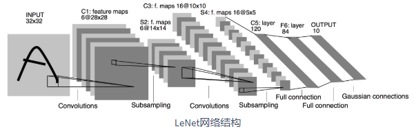

==================
经典卷积模型
==================

LeNet模型
######################

- 它是早期用来识别手写数字图像的卷积神经网络。这个名字来源于LeNet论文的第一作者Yann LeCun。LeNet展示了通过梯度下降训练卷积神经网络可以达到手写数字识别在当时最先进的结果。这个奠基性的工作第一次将卷积神经网络推上舞台，为世人所知。LeNet的网络结构如下图所示。

- LeNet分为卷积层块和全连接层块两个部分。使用sigmoid激活函数。参数量： ``total: 44426, trainable: 44426`` ,模型结构：

.. code:: python

	class LeNet(nn.Module):
	    """早期用来识别手写数字图像的卷积神经网络"""
	    def __init__(self):
	        super().__init__()
	        self.conv = nn.Sequential(
	            nn.Conv2d(1, 6, 5),  # in_channels, out_channels, kernel_size
	            nn.Sigmoid(),
	            nn.MaxPool2d(2, 2),  # kernel_size, stride
	            nn.Conv2d(6, 16, 5),
	            nn.Sigmoid(),
	            nn.MaxPool2d(2, 2))
	        # input_shape = (64, 1, 28, 28)  # 批量大小, 通道, 高, 宽
	        self.fc = nn.Sequential(
	            nn.Linear(16 * 4 * 4, 120),
	            nn.Sigmoid(),
	            nn.Linear(120, 84),
	            nn.Sigmoid(),
	            nn.Linear(84, 10))

	    def forward(self, img):
	        feature = self.conv(img)
	        output = self.fc(feature.view(img.shape[0], -1))
	        return output

- 卷积层输出形状计算：

.. code:: python

    """
    input_shape:(64, 1, 28, 28)
    layer:1 conv:(1, 6, 5), output_shape:(64, 6, 24, 24)
    layer:2 maxpool:(2, 2), output_shape:(64, 6, 12, 12)
    layer:3 conv:(6, 16, 5), output_shape:(64, 16, 8, 8)
    layer:4 maxpool:(2, 2), output_shape:(64, 16, 4, 4)
    output_shape:(64, 16, 4, 4)
    """

- 参考文献：LeCun, Y., Bottou, L., Bengio, Y., & Haffner, P. (1998). Gradient-based learning applied to document recognition. Proceedings of the IEEE, 86(11), 2278-2324.

AlexNet模型
######################

- 这个模型的名字来源于论文第一作者的姓名Alex Krizhevsky。AlexNet使用了8层卷积神经网络，并以很大的优势赢得了ImageNet 2012图像识别挑战赛。它首次证明了学习到的特征可以超越手工设计的特征，从而一举打破计算机视觉研究的前状。

.. image:: ./cnnModels.assets/alexnet_20200322161945.png
    :alt:
    :align: center

- 1、与相对较小的LeNet相比，AlexNet包含8层变换，其中有5层卷积和2层全连接隐藏层，以及1个全连接输出层。
- 2、AlexNet将sigmoid激活函数改成了更加简单的ReLU激活函数。
- 3、AlexNet通过丢弃法来控制全连接层的模型复杂度。
- 4、AlexNet引入了大量的图像增广，如翻转、裁剪和颜色变化，从而进一步扩大数据集来缓解过拟合。
- 简化后的模型结构如下图，参数数量 ``total: 46764746, trainable: 46764746`` :

.. code:: python

    class AlexNet(nn.Module):
	    """简化的AlexNet"""
	    def __init__(self):
	        super().__init__()
	        self.conv = nn.Sequential(
	            nn.Conv2d(1, 96, 11, 4),  # in_channels, out_channels, kernel_size, stride, padding
	            nn.ReLU(),
	            nn.MaxPool2d(3, 2),  # kernel_size, stride
	            # 减小卷积窗口，使用填充为2来使得输入与输出的高和宽一致，且增大输出通道数
	            nn.Conv2d(96, 256, 5, 1, 2),
	            nn.ReLU(),
	            nn.MaxPool2d(3, 2),
	            # 连续3个卷积层，且使用更小的卷积窗口。除了最后的卷积层外，进一步增大了输出通道数。
	            # 前两个卷积层后不使用池化层来减小输入的高和宽
	            nn.Conv2d(256, 384, 3, 1, 1),
	            nn.ReLU(),
	            nn.Conv2d(384, 384, 3, 1, 1),
	            nn.ReLU(),
	            nn.Conv2d(384, 256, 3, 1, 1),
	            nn.ReLU(),
	            nn.MaxPool2d(3, 2)
	        )
	        # input_shape = (64, 1, 224, 224)  # 批量大小, 通道, 高, 宽
	        # 这里全连接层的输出个数比LeNet中的大数倍。使用丢弃层来缓解过拟合
	        self.fc = nn.Sequential(
	            nn.Linear(256*5*5, 4096),
	            nn.ReLU(),
	            nn.Dropout(0.5),
	            nn.Linear(4096, 4096),
	            nn.ReLU(),
	            nn.Dropout(0.5),
	            # 输出层。由于这里使用Fashion-MNIST，所以用类别数为10，而非论文中的1000
	            nn.Linear(4096, 10),
	        )

	    def forward(self, img):
	        feature = self.conv(img)
	        output = self.fc(feature.view(img.shape[0], -1))
	        return output

- 卷积层输出形状计算：

.. code:: python

    """
    input_shape:(64, 1, 224, 224)
    layer:1 conv:(1, 96, 11, 4), output_shape:(64, 96, 54, 54)
    layer:2 maxpool:(3, 2), output_shape:(64, 96, 26, 26)
    layer:3 conv:(96, 256, 5, 1, 2), output_shape:(64, 256, 26, 26)
    layer:4 maxpool:(3, 2), output_shape:(64, 256, 12, 12)
    layer:5 conv:(256, 384, 3, 1, 1), output_shape:(64, 384, 12, 12)
    layer:6 conv:(2384, 384, 3, 1, 1), output_shape:(64, 384, 12, 12)
    layer:7 conv:(2384, 256, 3, 1, 1), output_shape:(64, 256, 12, 12)
    layer:8 maxpool:(3, 2), output_shape:(64, 256, 5, 5)
    output_shape:(64, 256, 5, 5)
    """

- 参考文献：Krizhevsky, A., Sutskever, I., & Hinton, G. E. (2012). Imagenet classification with deep convolutional neural networks. In Advances in neural information processing systems (pp. 1097-1105).