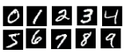
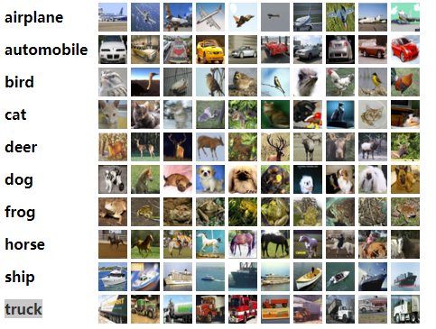

==================
数据读取与处理
==================

读取数据
######################

-  PyTorch提供了\ ``data``\ 包来读取数据。

.. code:: python

    features = torch.zeros(20, 2)  # 第一个维度表示样本数目，切分batch时以此为依据
    print('features:', features.shape)  # features: torch.Size([20, 2])
    labels = torch.ones(features.shape[0])  # labels: torch.Size([20])
    print('labels:', labels.shape)  # data_iter len: 3
    batch_size = 3
    # 将训练数据的特征和标签组合
    dataset = Data.TensorDataset(features, labels)  # tensors that have the same size of the first dimension.
    # 随机读取小批量
    data_iter = Data.DataLoader(dataset, batch_size, shuffle=True)
    print('data_iter len:', len(data_iter))  # data_iter len: 7
    for X, y in data_iter:
        print(X, y)
        break
    """输出
    tensor([[0., 0.],
    [0., 0.],
    [0., 0.]]) tensor([1., 1., 1.])
    """

-  ``Data.TensorDataset``\ ：输入的tensors需要\ **第一维的大小一致**.
-  ``Data.DataLoader``\ ：重要参数：

.. code:: shell

    batch_size(default: 1):批次大小;
    shuffle(default: False):每个epoch取数据时是否重新打乱数据;
    drop_last(default: False):不满batch_size时，最后一个批次是否删除;
    num_workers:(default: 0):多线程处理数据,windows下暂时不能设置多线程;

常用数据集
######################

MNIST
***************************

-  手写数字识别数据集。MNIST是深度学习最基本的数据集之一，由CNN鼻祖yann
   lecun建立的一个手写字符数据集，包含60000张训练图像和10000张测试图像，包含数字0-9共10个类别。

-  所属文献：LeCun, Y., Cortes, C., & Burges, C.
   http://yann.lecun.com/exdb/mnist/

FashionMNIST
***************************

-  10类衣服标签的数据集。zalando research的工作人员建立了fashion
   mnist数据集，该数据集由衣服、鞋子等服饰组成，包含70000张图像，其中60000张训练图像加10000张测试图像，图像大小为28x28，单通道，共分10个类，如下图，每3行表示一个类。数据大小：\ ``training.pt``\ 为45.3MB，\ ``test.pt``\ 为7.55MB。

.. figure:: ./dataLoader.assets/image-20200315103506843.png
    :alt: 
    :align: center

-  参考文献：Xiao, H., Rasul, K., & Vollgraf, R. (2017). Fashion-mnist: a novel image dataset for benchmarking machine learning algorithms. arXiv preprint arXiv:1708.07747.

-  每个 training 和 test 示例的标签如下：

===== =========== ======
Label Description 描述
===== =========== ======
0     T-shirt/top T恤
1     Trouser     裤子
2     Pullover    套衫
3     Dress       连衣裙
4     Coat        外套
5     Sandal      凉鞋
6     Shirt       衬衫
7     Sneaker     运动鞋
8     Bag         包
9     Ankle boot  短靴
===== =========== ======

-  加载数据，\ ``download=True``\ 首次使用时下载，若指定目录已经下载过，则不会重复下载：

.. code:: python

    mnist_train = torchvision.datasets.FashionMNIST(root='./data/FashionMNIST', train=True, download=True, transform=torchvision.transforms.ToTensor())
    mnist_test = torchvision.datasets.FashionMNIST(root='./data/FashionMNIST', train=False, download=True, transform=torchvision.transforms.ToTensor())
    print(type(mnist_train))  # <class 'torchvision.datasets.mnist.FashionMNIST'>
    print(len(mnist_train), len(mnist_test))  # 60000 10000

CIFAR10
***************************

-  数据集由10个类中的60000个32x32彩色图像组成，每个类有6000个图像。有50000个训练图像和10000个测试图像。
- 数据集介绍： https://www.cs.toronto.edu/~kriz/cifar.html
- 与 MNIST 数据集中目比， CIFAR-10 具有以下不同点：

    - CIFAR-10 是 3 通道的彩色 RGB 图像，而 MNIST 是灰度图像。
    - CIFAR-10 的图片尺寸为 32×32， 而 MNIST 的图片尺寸为 28×28，比 MNIST 稍大。
    - 相比于手写字符， CIFAR-10 含有的是现实世界中真实的物体，不仅噪声很大，而且物体的比例、 特征都不尽相同，这为识别带来很大困难。 直接的线性模型如 Softmax 在 CIFAR-10 上表现得很差。

- CIFAR-10 是由 Hinton 的学生 Alex Krizhevsky 和 Ilya Sutskever 整理的一个用于识别普适物体的小型数据集。一共包含 10 个类别的 RGB 彩色图 片：飞机（ a叩lane ）、汽车（ automobile ）、鸟类（ bird ）、猫（ cat ）、鹿（ deer ）、狗（ dog ）、蛙类（ frog ）、马（ horse ）、船（ ship ）和卡车（ truck ）。图片的尺寸为 32×32 ，数据集中一共有 50000 张训练圄片和 10000 张测试图片。 CIFAR-10 的图片样例如图所示。

.. code:: python

    torchvision.datasets.CIFAR10(train=True, root="~/Datasets/CIFAR", download=True)

CIFAR100
***************************

-  CIFAR-10类似，不同之处在于它有100个类，每个类包含600个图像。
- 每个类有500个训练图像和100个测试图像。
- CIFAR-100中的100个类被分为20个超类。
- 每个图像都带有一个“精细”标签（它所属的类）和一个“粗”标签（它所属的超类）。
