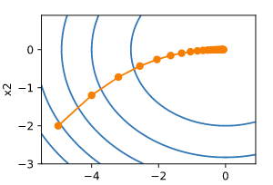
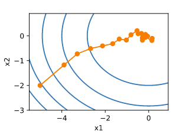

==================
梯度计算
==================

-  PyTorch提供的\ `autograd <https://pytorch.org/docs/stable/autograd.html>`__\ 包能够根据输入和前向传播过程自动构建计算图，并执行反向传播。

梯度自动计算
######################

-  将Tensor设置\ ``requires_grad=True``\ ，它将开始追踪(track)在其上的所有操作（这样就可以利用链式法则进行梯度传播了）。完成计算后，可以调用\ ``.backward()``\ 来完成所有梯度计算。此\ ``Tensor``\ 的梯度将累积到\ ``.grad``\ 属性中。

.. code:: python

   x = torch.ones(2)  # # 缺失情况下默认 requires_grad = False
   print(x, x.requires_grad)  # tensor([1., 1.]) False
   x.requires_grad_(True)  # 通过.requires_grad_()用in-place的方式改变requires_grad属性
   print(x, x.requires_grad)  # tensor([1., 1.], requires_grad=True) True
   x = torch.ones(2, requires_grad=True)
   print(x, x.requires_grad)  # tensor([1., 1.], requires_grad=True) True

-  **注意：在y.backward()时**\ ，如果\ ``y``\ 是标量，则不需要为\ ``backward()``\ 传入任何参数；否则，需要传入一个与\ ``y``\ 同形的\ ``Tensor``\ 。参考：backward为什么有一个grad_variables参数\ https://zhuanlan.zhihu.com/p/29923090

.. code:: python

   x = torch.ones(2, requires_grad=True)
   y = x * x
   print(y, y.grad_fn)  # tensor([1., 1.], grad_fn=<MulBackward0>) <MulBackward0 object at 0x000001521DC5BF60>
   y = y.sum()
   print(y, y.grad_fn)  # tensor(2., grad_fn=<SumBackward0>) <SumBackward0 object at 0x000001521DC5BF60>
   print(x.grad)  # None
   print(y.backward())  # None 等价于 y.backward(torch.tensor(1.))
   print(x.grad)  # tensor([2., 2.])

-  调用\ ``.detach()``\ 将其从追踪记录中分离出来，这样就可以防止将来的计算被追踪，这样梯度就传不过去了。此外，还可以用\ ``with torch.no_grad()``\ 将不想被追踪的操作代码块包裹起来，这种方法在\ **评估模型的时候很常用**\ ，因为在评估模型时，我们并不需要计算可训练参数（\ ``requires_grad=True``\ ）的梯度。

.. code:: python

   x = torch.ones(2, requires_grad=True)
   y = (x * x).sum()
   print(y, y.grad_fn)  # tensor(2., grad_fn=<SumBackward0>) <SumBackward0 object at 0x000001A08211D1D0>
   with torch.no_grad():  # 中断梯度追踪
       y = (x * x).sum()
       print(y, y.grad_fn)  # tensor(2.) None

-  如果我们想要修改\ ``tensor``\ 的数值，但是又不希望被\ ``autograd``\ 记录（即不会影响反向传播），那么我么可以对\ ``tensor.data``\ 进行操作。\ **requires_grad=True的叶子节点，不能进行in-place操作。**

.. code:: 

   x = torch.ones(1, requires_grad=True)
   print(x.data)  # tensor([1.]),data也是一个tensor
   print(x.data.requires_grad)  # False，已经是独立于计算图之外
   y = 2 * x
   x.data *= 100  # 只改变了值，不会记录在计算图，所以不会影响梯度传播
   y.backward()
   print(x)  # tensor([100.], requires_grad=True)，更改data的值也会影响tensor的值
   print(x.grad)  # tensor([2.])
   print('{} 不使用data，直接操作tensor {}'.format('-'*15, '-'*15))
   # x = torch.ones(1, requires_grad=True)
   # y = 2 * x
   # x *= 100  # RuntimeError: a leaf Variable that requires grad has been used in an in-place operation.

-  ``Function``\ 是另外一个很重要的类。\ ``Tensor``\ 和\ ``Function``\ 互相结合就可以构建一个记录有整个计算过程的有向无环图（DAG）。每个\ ``Tensor``\ 都有一个\ ``.grad_fn``\ 属性，该属性即创建该\ ``Tensor``\ 的\ ``Function``,
   就是说该\ ``Tensor``\ 是不是通过某些运算得到的，若是，则\ ``grad_fn``\ 返回一个与这些运算相关的对象，否则是None。像x这种直接创建的称为叶子节点，叶子节点对应的\ ``grad_fn``\ 是\ ``None``\ 。

.. code:: python

   x = torch.ones(2)
   print(x.grad_fn)  # None
   y = x * 2
   print(y)  # tensor([2., 2.])
   print(x.grad_fn, y.grad_fn)  # None None
   print('{} 设置requires_grad=True {}'.format('-'*15, '-'*15))
   x = torch.ones(2, requires_grad=True)
   print(x.grad_fn)  # None 直接创建的Tensor没有grad_fn，被称为叶子节点。
   y = x * 2
   print(x.is_leaf, y.is_leaf)  # True False
   print(y)  # tensor([2., 2.], grad_fn=<MulBackward0>)
   print(x.grad_fn, y.grad_fn)  # None <MulBackward0 object at 0x00000282A67BCF28>

雅克比矩阵
***************************

-  数学上，如果有一个函数值和自变量都为向量的函数
   :math:`\vec{y} =f(\vec{x})`, 那么 :math:`\vec{y}`\ 关于
   :math:`\vec{x}` 的梯度就是一个雅可比矩阵\ ``（Jacobian matrix）``:

.. math:: J=(\frac{\partial y_{1}}{\partial x_{1}}⋯\frac{\partial y_{1}}{\partial x_{n}} ⋮⋱⋮ \frac{\partial y_{m}}{\partial x_{1}}⋯\frac{\partial y_{m}}{\partial x_{n}})

-  在向量分析中，\ **雅可比矩阵**\ 是函数的一阶偏导数以一定方式排列成的矩阵，其行列式称为\ **雅可比行列式**\ 。\ ``Jacobian``\ 可以发音为\ ``[ja ˈko bi ən]``\ 。假设\ :math:`F:\mathbb{R}_{n}\rightarrow \mathbb{R}_{m}`
   是一个从n维欧式空间映射到m维欧式空间的函数。这个函数由m个实数组成：\ :math:`y_{1}(x_{1},\cdots ,x_{n}),\cdots,y_{m}(x_{1},\cdots ,x_{n})`
   。这些函数的偏导数（如果存在）可以组成一个m行n列的矩阵，这个矩阵就是所谓的雅克比矩阵：

.. math::

   \begin{bmatrix}
   \frac{\partial y_{1}}{\partial x_{1}} & \cdots & \frac{\partial y_{1}}{\partial x_{n}}\\ 
   \vdots  & \ddots  & \vdots\\ 
   \frac{\partial y_{m}}{\partial x_{1}} & \cdots & \frac{\partial y_{m}}{\partial x_{n}}
   \end{bmatrix}

-  而\ ``torch.autograd``\ 这个包就是用来计算一些雅克比矩阵的乘积的。例如，如果
   :math:`v` 是一个标量函数的 :math:`l=g(\vec{y} )` 的梯度：

.. math:: v=(\frac{\partial l}{\partial y_{1}}⋯\frac{\partial l}{\partial y_{m}})

-  那么根据链式法则我们有 :math:`l` 关于 :math:`\vec{x}`
   的雅克比矩阵就为:

.. math:: vJ=(\frac{\partial l}{\partial y_{1}}⋯\frac{\partial l}{\partial y_{m}})(\frac{\partial y_{1}}{\partial x_{1}}⋯\frac{\partial y_{1}}{\partial x_{n}} ⋮⋱⋮ \frac{\partial y_{m}}{\partial x_{1}}⋯\frac{\partial y_{m}}{\partial x_{n}})=(\frac{\partial _{l}}{\partial x_{1}}⋯\frac{\partial l}{\partial x_{n}})

-  注意：grad在反向传播过程中是累加的(``accumulated``)，这意味着每一次运行反向传播，梯度都会累加之前的梯度，所以一般在反向传播之前需把梯度清零。

.. code:: python

   x = torch.ones(2, requires_grad=True)
   y = (x * x).sum()
   y.backward()
   print(x.grad)  # tensor([2., 2.])
   y = (x * x).sum()
   y.backward()
   print(x.grad)  # tensor([4., 4.])；梯度累加
   x.grad.data.zero_()  # 梯度清零
   y = (x * x).sum()
   y.backward()
   print(x.grad)  # tensor([2., 2.])

梯度下降
######################

- 梯度下降（gradient descent），使用适当的学习率，沿着梯度反方向更新自变量可能降低目标函数值。梯度下降重复这一更新过程直到得到满足要求的解。

一维梯度下降
***************************

- 我们先以简单的一维梯度下降为例，解释梯度下降算法可能降低目标函数值的原因。假设连续可导的函数 :math:`f: \mathbb{R} \rightarrow \mathbb{R}` 的输入和输出都是标量。给定绝对值足够小的数 :math:`\epsilon` ，根据泰勒展开公式，我们得到以下的近似：

.. math::

    f(x + \epsilon) \approx f(x) + \epsilon f'(x)

- 这里 :math:`f'(x)` 是函数 :math:`f` 在 :math:`x` 处的梯度。一维函数的梯度是一个标量，也称导数。
- 接下来，找到一个常数 :math:`\eta > 0` ，使得 :math:`\left|\eta f'(x)\right|` 足够小，那么可以将 :math:`\epsilon` 替换为 :math:`-\eta f'(x)` 并得到

.. math::

    f(x - \eta f'(x)) \approx f(x) -  \eta f'(x)^2

- 如果导数 :math:`f'(x) \neq 0` ，那么 :math:`\eta f'(x)^2>0` ，所以

.. math::

    f(x - \eta f'(x)) \lesssim f(x)

- 这意味着，如果通过

.. math::

    x \leftarrow x - \eta f'(x)

- 来迭代 :math:`x` ，函数 :math:`f(x)` 的值可能会降低。因此在梯度下降中，我们先选取一个初始值 :math:`x` 和常数 :math:`\eta > 0` ，然后不断通过上式来迭代 :math:`x` ，直到达到停止条件，例如 :math:`f'(x)^2` 的值已足够小或迭代次数已达到某个值。
- 如果使用 **过大的学习率** ， :math:`\left|\eta f'(x)\right|` 可能会过大从而使前面提到的一阶泰勒展开公式不再成立：这时我们无法保证迭代 :math:`x` 会降低 :math:`f(x)` 的值。

多维梯度下降
***************************

- 一种更广义的情况：目标函数的输入为向量，输出为标量。假设目标函数 :math:`f: \mathbb{R}^d \rightarrow \mathbb{R}` 的输入是一个 :math:`d` 维向量 :math:`\boldsymbol{x} = [x_1, x_2, \ldots, x_d]^\top` 。目标函数 :math:`f(\boldsymbol{x})` 有关 :math:`\boldsymbol{x}` 的梯度是一个由 :math:`d` 个偏导数组成的向量：

.. math::

    \nabla_{\boldsymbol{x}} f(\boldsymbol{x}) = \bigg[\frac{\partial f(\boldsymbol{x})}{\partial x_1}, \frac{\partial f(\boldsymbol{x})}{\partial x_2}, \ldots, \frac{\partial f(\boldsymbol{x})}{\partial x_d}\bigg]^\top.

- 为表示简洁，我们用 :math:`\nabla f(\boldsymbol{x})` 代替 :math:`\nabla_{\boldsymbol{x}} f(\boldsymbol{x})` 。梯度中每个偏导数元素 :math:`\partial f(\boldsymbol{x})/\partial x_i` 代表着 :math:`f` 在 :math:`\boldsymbol{x}` 有关输入 :math:`x_i` 的变化率。为了测量 :math:`f` 沿着单位向量 :math:`\boldsymbol{u}` （即 :math:`\|\boldsymbol{u}\|=1` ）方向上的变化率，在多元微积分中，我们定义 :math:`f` 在 :math:`\boldsymbol{x}` 上沿着 :math:`\boldsymbol{u}` 方向的方向导数为

.. math::

    \text{D}_{\boldsymbol{u}} f(\boldsymbol{x}) = \lim_{h \rightarrow 0}  \frac{f(\boldsymbol{x} + h \boldsymbol{u}) - f(\boldsymbol{x})}{h}.

- 依据方向导数性质，以上方向导数可以改写为

.. math::

    \text{D}_{\boldsymbol{u}} f(\boldsymbol{x}) = \nabla f(\boldsymbol{x}) \cdot \boldsymbol{u}.

- 方向导数 :math:`\text{D}_{\boldsymbol{u}} f(\boldsymbol{x})` 给出了 :math:`f` 在 :math:`\boldsymbol{x}` 上沿着所有可能方向的变化率。为了最小化 :math:`f` ，我们希望找到 :math:`f` 能被降低最快的方向。因此，我们可以通过单位向量 :math:`\boldsymbol{u}` 来最小化方向导数 :math:`\text{D}_{\boldsymbol{u}} f(\boldsymbol{x})` 。
- 由于 :math:`\text{D}_{\boldsymbol{u}} f(\boldsymbol{x}) = \|\nabla f(\boldsymbol{x})\| \cdot \|\boldsymbol{u}\|  \cdot \text{cos} (\theta) = \|\nabla f(\boldsymbol{x})\|  \cdot \text{cos} (\theta)` ，
- 其中 :math:`\theta` 为梯度 :math:`\nabla f(\boldsymbol{x})` 和单位向量 :math:`\boldsymbol{u}` 之间的夹角，当 :math:`\theta = \pi` 时， :math:`\text{cos}(\theta)` 取得最小值 :math:`-1` 。因此，当 :math:`\boldsymbol{u}` 在梯度方向 :math:`\nabla f(\boldsymbol{x})` 的相反方向时，方向导数 :math:`\text{D}_{\boldsymbol{u}} f(\boldsymbol{x})` 被最小化。因此，我们可能通过梯度下降算法来不断降低目标函数 :math:`f` 的值：

.. math::

    \boldsymbol{x} \leftarrow \boldsymbol{x} - \eta \nabla f(\boldsymbol{x}).

- 同样，其中 :math:`\eta` （取正数）称作学习率。
- 下图为一个输入为二维向量 :math:`\boldsymbol{x} = [x_1, x_2]^\top` 和输出为标量的目标函数 :math:`f(\boldsymbol{x})=x_1^2+2x_2^2` 。

随机梯度下降
######################

- 随机梯度下降（stochastic gradient descent，SGD），当训练数据集的样本较多时，梯度下降每次迭代的计算开销较大，因而随机梯度下降通常更受青睐。。
- 在深度学习里，目标函数通常是训练数据集中有关各个样本的损失函数的平均。设 :math:`f_i(\boldsymbol{x})` 是有关索引为 :math:`i` 的训练数据样本的损失函数， :math:`n` 是训练数据样本数， :math:`\boldsymbol{x}` 是模型的参数向量，那么目标函数定义为

.. math::

    f(\boldsymbol{x}) = \frac{1}{n} \sum_{i = 1}^n f_i(\boldsymbol{x}).

- 目标函数在 :math:`\boldsymbol{x}` 处的梯度计算为

.. math::

    \nabla f(\boldsymbol{x}) = \frac{1}{n} \sum_{i = 1}^n \nabla f_i(\boldsymbol{x}).

- 如果使用梯度下降，每次自变量迭代的计算开销为 :math:`\mathcal{O}(n)` ，它随着 :math:`n` 线性增长。因此，当训练数据样本数很大时，梯度下降每次迭代的计算开销很高。
- 随机梯度下降（stochastic gradient descent，SGD）减少了每次迭代的计算开销。在随机梯度下降的每次迭代中，我们随机均匀采样的一个样本索引 :math:`i\in\{1,\ldots,n\}` ，并计算梯度 :math:`\nabla f_i(\boldsymbol{x})` 来迭代 :math:`\boldsymbol{x}` ：

.. math::

    \boldsymbol{x} \leftarrow \boldsymbol{x} - \eta \nabla f_i(\boldsymbol{x}).

- 这里 :math:`\eta` 同样是学习率。可以看到每次迭代的计算开销从梯度下降的 :math:`\mathcal{O}(n)` 降到了常数 :math:`\mathcal{O}(1)` 。值得强调的是，随机梯度 :math:`\nabla f_i(\boldsymbol{x})` 是对梯度 :math:`\nabla f(\boldsymbol{x})` 的无偏估计：

.. math::

    E_i \nabla f_i(\boldsymbol{x}) = \frac{1}{n} \sum_{i = 1}^n \nabla f_i(\boldsymbol{x}) = \nabla f(\boldsymbol{x}).

- 这意味着，平均来说，随机梯度是对梯度的一个良好的估计。

- 可以看到，随机梯度下降中自变量的迭代轨迹相对于梯度下降中的来说更为曲折。
