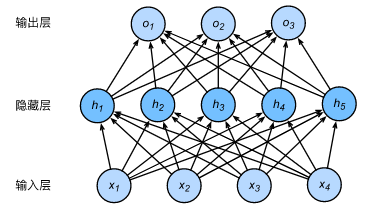
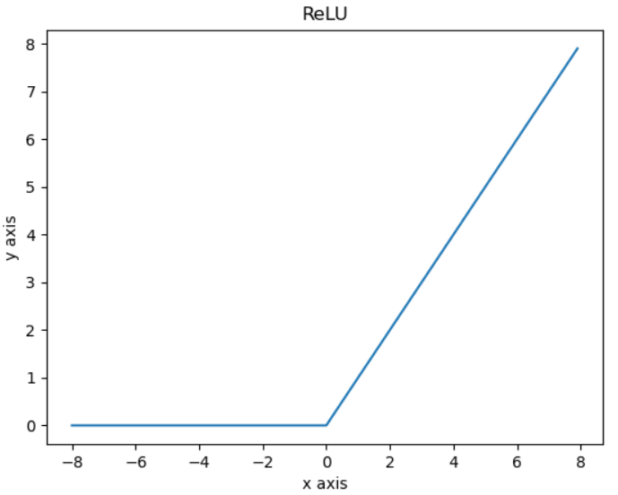
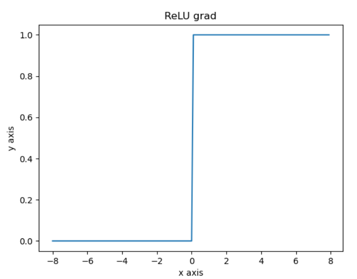
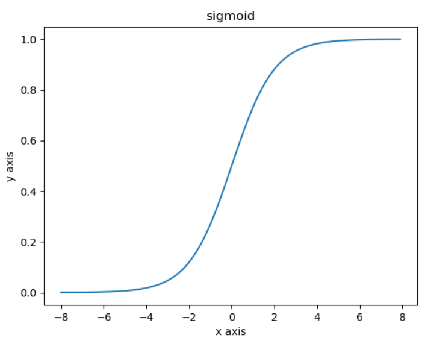
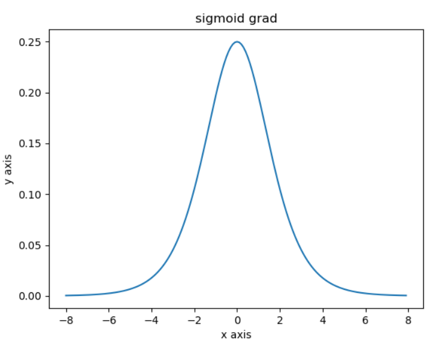
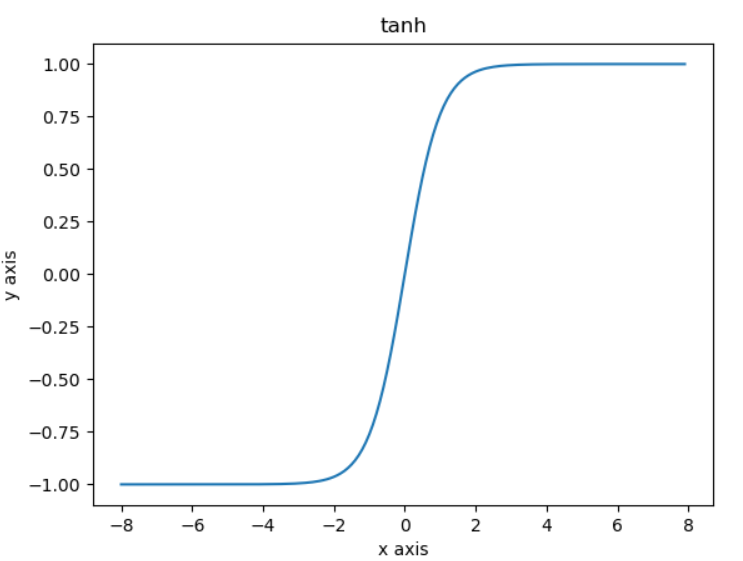
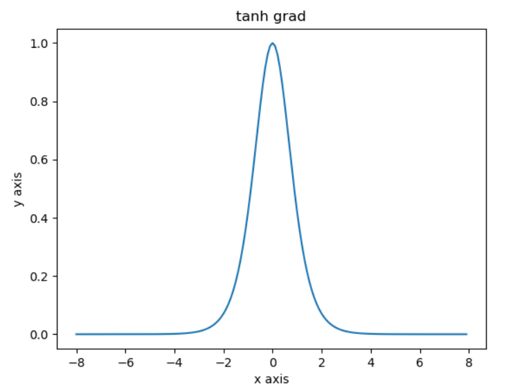
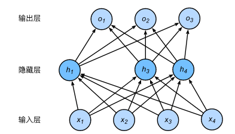

==================
多层感知器
==================

-  多层感知器（multilayer
   perceptron，MLP）：分为输入层、隐藏层、输出层。隐藏层中的神经元和输入层中各个输入完全连接，输出层中的神经元和隐藏层中的各个神经元也完全连接。因此，多层感知机中的隐藏层和输出层都是全连接层（fully-connected
   layer，也叫稠密层dense layer）。

-  多层感知机就是含有至少一个隐藏层的由全连接层组成的神经网络，且每个隐藏层的输出通过激活函数进行变换。多层感知机的层数和各隐藏层中隐藏单元个数都是超参数。多层感知机按以下方式计算输出：

   .. math::

      \begin{aligned}
      \boldsymbol{H} &= \phi(\boldsymbol{X} \boldsymbol{W}_h + \boldsymbol{b}_h),\\
      \boldsymbol{O} &= \boldsymbol{H} \boldsymbol{W}_o + \boldsymbol{b}_o,
      \end{aligned}

-  其中\ :math:`\phi`\ 表示激活函数。在分类问题中，我们可以对输出\ :math:`\boldsymbol{O}`\ 做softmax运算，并使用softmax回归中的交叉熵损失函数。在回归问题中，我们将输出层的输出个数设为1，并将输出\ :math:`\boldsymbol{O}`\ 直接提供给线性回归中使用的平方损失函数。

激活函数
######################

-  激活函数（activation function）：全连接层只是对数据做仿射变换（affine
   transformation），而多个仿射变换的叠加仍然是一个仿射变换。解决问题的一个方法是引入非线性变换，例如对隐藏变量使用按元素运算的非线性函数进行变换，然后再作为下一个全连接层的输入。这个\ **非线性函数被称为激活函数**\ 。

ReLU
***************************

-  ReLU（rectified linear
   unit）函数提供了一个很简单的非线性变换。给定元素\ :math:`x`\ ，该函数定义为

.. math:: \text{ReLU}(x) = \max(x, 0)

-  当输入为负数时，ReLU函数的导数为0；当输入为正数时，ReLU函数的导数为1。尽管输入为0时ReLU函数不可导，但是我们可以取此处的导数为0。

sigmoid
***************************

-  sigmoid函数可以将元素的值变换到0和1之间：

.. math:: \text{sigmoid}(x) = \frac{1}{1 + \exp(-x)}

-  依据链式法则，sigmoid函数的导数

.. math:: \text{sigmoid}'(x) = \text{sigmoid}(x)\left(1-\text{sigmoid}(x)\right)

-  当输入为0时，sigmoid函数的导数达到最大值0.25；当输入越偏离0时，sigmoid函数的导数越接近0。

tanh
***************************

-  tanh（双曲正切）函数可以将元素的值变换到-1和1之间：

   .. math:: \text{tanh}(x) = \frac{1 - \exp(-2x)}{1 + \exp(-2x)}

-  当输入为0时，tanh函数的导数达到最大值1；当输入越偏离0时，tanh函数的导数越接近0。

损失函数
######################

-  在机器学习里，将衡量误差的函数称为损失函数（loss
   function）。例如常见的平方误差函数也称为平方损失（square
   loss），\ *除以2是为了更方便的求导*\ ：

.. math:: \ell^{(i)}(w, b) = \frac{1}{2} \left(\hat{y}^{(i)} - y^{(i)}\right)^2

-  PyTorch在\ ``nn``\ 模块中提供了各种损失函数，这些损失函数可看作是一种特殊的层，PyTorch也将这些损失函数实现为\ ``nn.Module``\ 的子类。

.. code:: python

   loss = nn.MSELoss()  # 均方误差损失
   print(loss)  # MSELoss()
   pred_y = torch.tensor([-1, -1], dtype=torch.float)
   y = torch.tensor([1, 1], dtype=torch.float)
   print(loss(pred_y, y))  # tensor(4.),数据类型不能为int

优化算法
######################

-  当模型和损失函数形式较为简单时，误差最小化问题的解可以直接用公式表达出来。这类解叫作\ **解析解（analytical
   solution）**\ 。然而，大多数深度学习模型并没有解析解，只能通过优化算法有限次迭代模型参数来尽可能降低损失函数的值。这类解叫作\ **数值解（numerical
   solution）**\ 。
-  **小批量随机梯度下降**\ （mini-batch stochastic gradient
   descent）：在每次迭代中，先随机均匀采样一个由固定数目训练数据样本所组成的小批量（mini-batch）\ :math:`\mathcal{B}`\ ，然后求小批量中数据样本的平均损失有关模型参数的导数（梯度），最后用此结果与预先设定的一个正数的乘积作为模型参数在本次迭代的减小量。
-  ``torch.optim``\ 模块提供了很多常用的优化算法比如SGD、Adam和RMSProp等。

.. code:: python

   net = nn.Sequential()
   net.add_module('linear', nn.Linear(5, 1))
   optimizer = torch.optim.SGD(net.parameters(), lr=0.03)  # 小批量随机梯度下降,lr为必须参数
   print(optimizer)
   """
   SGD (
   Parameter Group 0
   	dampening: 0
   	lr: 0.03
   	momentum: 0
   	nesterov: False
   	weight_decay: 0
   )
   """

-  为不同子网络设置不同的学习率，这\ **在finetune时经常用到**:

.. code:: python

   optimizer =optim.SGD([
                   # 如果对某个参数不指定学习率，就使用最外层的默认学习率
                   {'params': net.subnet1.parameters()}, # lr=0.03
                   {'params': net.subnet2.parameters(), 'lr': 0.01}
               ], lr=0.03)

-  调整学习率：要有两种做法。一种是修改\ ``optimizer.param_groups``\ 中对应的学习率，另一种是更简单也是较为推荐的做法——新建优化器，由于optimizer十分轻量级，构建开销很小，故而可以构建新的optimizer。但是后者对于使用动量的优化器（如Adam），会丢失动量等状态信息，可能会造成损失函数的收敛出现震荡等情况。

.. code:: python

   for param_group in optimizer.param_groups:
       param_group['lr'] *= 0.1 # 学习率为之前的0.1倍

模型定义
######################

-  ``torch.nn``\ 模块定义了大量神经网络的层。“nn”是neural
   networks（神经网络）的缩写。它利用\ ``autograd``\ 来定义模型。。\ ``nn``\ 的核心数据结构是\ ``Module``\ ，既可以表示神经网络中的某个层（layer），也可以表示一个包含很多层的神经网络。\ ``nn.Module``\ 实例应该包含一些层以及返回输出的前向传播（forward）方法。

.. code:: python

   class LinearNet(nn.Module):
       def __init__(self, n_feature):
       super(LinearNet, self).__init__()
       self.linear = nn.Linear(n_feature, 1)

       def forward(self, x):
       """定义前向传播"""
       y = self.linear(x)
       return y

   net = LinearNet(n_feature=5)
   print(net)  # 打印输出网络结构
   """输出
   LinearNet(
   (linear): Linear(in_features=5, out_features=1, bias=True)
   )
   """

-  如下为使用\ ``nn.Sequential``\ **搭建网络的三种方法**\ ，\ ``Sequential``\ 是一个有序的容器，网络层将按照在传入\ ``Sequential``\ 的顺序依次被添加到计算图中。

.. code:: python

   num_inputs = 5
   # 写法一：module的name被自动设置为序号
   net = nn.Sequential(
       nn.Linear(num_inputs, 1)
       # 此处还可以传入其他层
   )
   print(net)
   """输出
   Sequential(
   (0): Linear(in_features=5, out_features=1, bias=True)
   )
   """
   # 写法二：add_module第一个参数为module的name
   net = nn.Sequential()
   net.add_module('linear', nn.Linear(num_inputs, 1))
   # net.add_module ......
   print(net)
   """输出
   Sequential(
   (linear): Linear(in_features=5, out_features=1, bias=True)
   )
   """
   # 写法三
   from collections import OrderedDict
   net = nn.Sequential(
       OrderedDict([
           ('linear', nn.Linear(num_inputs, 1))
           # ......
       ])
   )
   print(net)
   """输出
   Sequential(
   (linear): Linear(in_features=5, out_features=1, bias=True)
   )
   """

-  注意：\ ``torch.nn``\ 仅支持输入一个batch的样本不支持单个样本输入，如果\ **只有单个样本**\ ，可使用\ ``input.unsqueeze(0)``\ 来添加一维。

模型参数
######################

-  通过\ ``net.parameters()``\ 来查看模型所有的可学习参数，此函数将返回一个生成器。

.. code:: python

   net = nn.Sequential()
   net.add_module('linear', nn.Linear(5, 1))
   for param in net.parameters():
   print(param)
   """输出
   Parameter containing:
   tensor([[-0.0567,  0.1161,  0.1954, -0.2397,  0.3248]], requires_grad=True)
   Parameter containing:
   tensor([-0.0782], requires_grad=True)
   """

-  ``net.named_parameters()``\ 可以返回参数名称。

.. code:: python

   for name, param in net.named_parameters():
   print('name:{}, param:{}'.format(name, param))
   """
   name:linear.weight, param:Parameter containing:
   tensor([[-0.3299, -0.2503,  0.1922, -0.3915, -0.2623]], requires_grad=True)
   name:linear.bias, param:Parameter containing:
   tensor([-0.4374], requires_grad=True)
   """

初始化模型参数
***************************

- PyTorch中nn.Module的模块参数都采取了较为合理的初始化策略，因此一般不用我们考虑。
-  在使用\ ``net``\ 前，我们需要初始化模型参数。PyTorch在\ ``init``\ 模块中提供了多种参数初始化方法。这里的\ ``init``\ 是\ ``initializer``\ 的缩写形式。
-  通过\ ``init.normal_``\ 将权重参数每个元素初始化为随机采样于均值为0、标准差为0.01的正态分布。偏差会初始化为零。

.. code:: python

   net = nn.Sequential()
   net.add_module('linear', nn.Linear(5, 1))
   print('初始化前')
   for param in net.parameters():
   print(param)
   """输出
   Parameter containing:
   tensor([[-0.0567,  0.1161,  0.1954, -0.2397,  0.3248]], requires_grad=True)
   Parameter containing:
   tensor([-0.0782], requires_grad=True)
   """
   nn.init.normal_(net[0].weight, mean=0, std=0.01)
   nn.init.constant_(net[0].bias, val=0)  # 也可以直接修改bias的data: net[0].bias.data.fill_(0)
   print('初始化后')
   for param in net.parameters():
   print(param)
   """
   Parameter containing:
   tensor([[0.0037, 0.0178, 0.0186, 0.0216, 0.0020]], requires_grad=True)
   Parameter containing:
   tensor([0.], requires_grad=True)
   """

-  如果需要使用name定位某一层时，则\ ``net[0].weight``\ 应改为\ ``net.linear.weight``\ ，\ ``bias``\ 亦然。因为\ ``net[0]``\ 这样根据下标访问子模块的写法只有当\ ``net``\ 是个\ ``ModuleList``\ 或者\ ``Sequential``\ 实例时才可以。

-  常用的还有\ ``xavier_normal_``\ 。Xavier随机初始化，假设某全连接层的输入个数为 :math:`a` ，输出个数为 :math:`b` ，Xavier随机初始化将使该层中权重参数的每个元素都随机采样于均匀分布,它的设计主要考虑到，模型参数初始化后，每层输出的方差不该受该层输入个数影响，且每层梯度的方差也不该受该层输出个数影响。

.. math::

   U\left(-\sqrt{\frac{6}{a+b}}, \sqrt{\frac{6}{a+b}}\right)

训练模型
######################

-  构造数据=》加载数据=》定义模型=》定义优化器=》定义损失函数=》进行训练。
-  通过调用\ ``optim``\ 实例的\ ``step``\ 函数来迭代模型参数。训练时注意\ ``optimizer.zero_grad()``\ 梯度清零，防止梯度一直累加。

.. code:: python

   # 构造数据
   num_samples = 200  # 样本个数
   num_inputs = 2  # 特征个数
   features = torch.randn(num_samples, num_inputs)
   print('features shape:{}, dtype:{}'.format(features.shape, features.dtype))  # features shape:torch.Size([200, 2]), dtype:torch.float32
   label_weight = [2.0, 5.0]  # 定义一个线性函数
   label_bias = 6.0
   labels = torch.randn(num_samples)
   labels += label_weight[0] * features[:, 0] + label_weight[1] * features[:, 1] + label_bias
   print('labels shape:{}, dtype:{}'.format(labels.shape, labels.dtype))  # labels shape:torch.Size([200]), dtype:torch.float32
   # 加载数据
   batch_size = 8
   dataset = torch.utils.data.TensorDataset(features, labels)
   data_iter = torch.utils.data.DataLoader(dataset, batch_size, shuffle=True)
   print('data_iter len:{}'.format(len(data_iter)))
   # for X, y in data_iter:
   #     print(X, y)
   #     break
   # 定义模型
   net = nn.Sequential()
   net.add_module('linear', nn.Linear(num_inputs, 1))
   print(net)
   """
   Sequential(
   (linear): Linear(in_features=2, out_features=1, bias=True)
   )
   """
   # 定义优化器
   optimizer = torch.optim.SGD(net.parameters(), lr=0.03)
   # 定义损失函数
   loss = nn.MSELoss()
   # 进行训练
   num_epochs = 8
   for epoch in range(1, num_epochs + 1):
   	for X, y in data_iter:
   		output = net(X)  # 模型前向传播
   		loss_value = loss(output, y.view(-1, 1))  # 计算loss
   		optimizer.zero_grad()  # 梯度清零，等价于net.zero_grad()
   		loss_value.backward()  # 反向传播
   		optimizer.step()  # 迭代模型参数
   	print('epoch %d, loss: %f' % (epoch, loss_value.item()))
   # 输出训练后的结果
   print(label_weight, net[0].weight.data)  # [2.0, 5.0] tensor([[2.0171, 4.9683]])
   print(label_bias, net[0].bias.data)  # 6.0 tensor([6.0194])
   """
   epoch 1, loss: 5.885800
   epoch 2, loss: 0.424021
   epoch 3, loss: 0.963439
   epoch 4, loss: 1.011478
   epoch 5, loss: 1.178113
   epoch 6, loss: 0.847684
   epoch 7, loss: 0.644298
   epoch 8, loss: 0.848485
   """

模型调优
######################

- 权重衰减（weight decay）等价于 :math:`L_2`  范数正则化（regularization）。正则化通过为模型损失函数添加惩罚项使学出的模型参数值较小，是应对过拟合的常用手段。权重衰减可以通过优化器中的 ``weight_decay`` 超参数来指定。

- 丢弃法（dropout）常常被用来应对过拟合问题。 **丢弃法不改变其输入的期望值。** 被丢弃的隐藏单元相关的权重的梯度均为0。由于在训练中隐藏层神经元的丢弃是随机的，输出层的计算无法过度依赖隐藏层中的任一个，从而在训练模型时起到正则化的作用，并可以用来应对过拟合。在测试模型时，我们为了拿到更加确定性的结果，一般不使用丢弃法。 **丢弃法只在训练模型时使用。** 参考文献：Dropout: a simple way to prevent neural networks from overfitting. JMLR

- 在PyTorch中，我们只需要在全连接层后添加Dropout层并指定丢弃概率。在训练模型时，Dropout层将以指定的丢弃概率随机丢弃上一层的输出元素；在测试模型时（即model.eval()后），Dropout层并不发挥作用。  ``nn.Dropout(p=0.2)`` p表示被丢弃的概率。

