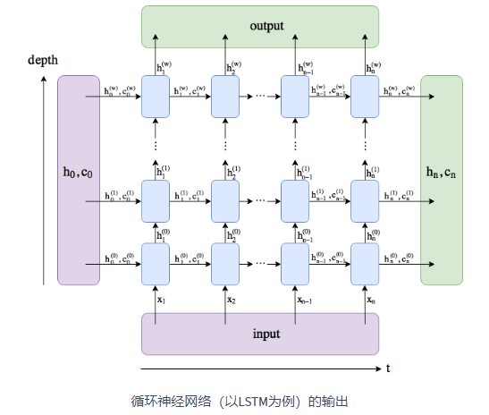

==================
循环神经网络
==================

- 循环神经网络（recurrent neural network）。循环神经网络的隐藏状态可以捕捉截至当前时间步的序列的历史信息。循环神经网络模型参数的数量不随时间步的增加而增长。
- 下图展示了循环神经网络在3个相邻时间步的计算逻辑。在时间步 :math:`t` ，隐藏状态的计算可以看成是将输入 :math:`\boldsymbol{X}_t` 和前一时间步隐藏状态 :math:`\boldsymbol{H}_{t-1}` 连结后输入一个激活函数为 :math:`\phi` 的全连接层。该全连接层的输出就是当前时间步的隐藏状态 :math:`\boldsymbol{H}_t` ，且模型参数为 :math:`\boldsymbol{W}_{xh}` 与 :math:`\boldsymbol{W}_{hh}` 的连结，偏差为 :math:`\boldsymbol{b}_h` 。当前时间步 :math:`t` 的隐藏状态 :math:`\boldsymbol{H}_t` 将参与下一个时间步 :math:`t+1` 的隐藏状态 :math:`\boldsymbol{H}_{t+1}` 的计算，并输入到当前时间步的全连接输出层。

.. image:: ./rnn.assets/rnn_20200326232143.png
    :alt:
    :align: center

- 隐藏状态中 :math:`\boldsymbol{X}_t \boldsymbol{W}_{xh} + \boldsymbol{H}_{t-1} \boldsymbol{W}_{hh}` 的计算等价于 :math:`\boldsymbol{X}_t` 与 :math:`\boldsymbol{H}_{t-1}` 连结后的矩阵乘以 :math:`\boldsymbol{W}_{xh}` 与 :math:`\boldsymbol{W}_{hh}` 连结后的矩阵。
- 可以基于字符级循环神经网络来创建语言模型。因为每个输入词是一个字符，因此这个模型被称为字符级循环神经网络（character-level recurrent neural network）。

RNN模型定义
######################

- 示例中 ``rnn_layer`` 的输入形状为(时间步数, 批量大小, 输入个数)。其中输入个数即one-hot向量长度（词典大小）。此外， ``rnn_layer`` 作为 ``nn.RNN`` 实例，在前向计算后会分别返回输出和隐藏状态h，其中输出指的是隐藏层在 **各个时间步** 上计算并输出的隐藏状态，它们通常作为后续输出层的输入。需要强调的是，该“输出”本身并不涉及输出层计算，形状为(时间步数, 批量大小, 隐藏单元个数)。而 ``nn.RNN`` 实例在前向计算返回的隐藏状态指的是隐藏层在 **最后时间步** 的隐藏状态：当隐藏层有多层时，每一层的隐藏状态都会记录在该变量中；对于像长短期记忆（LSTM），隐藏状态是一个元组(h, c)，即hidden state和cell state。下图其LSTM的输出：

- 构造示例  ``rnn_layer`` :
- 输入输出形状(seq_len, batch, input_size)；
- 输出形状为(seq_len, batch, num_directions\*hidden_size)；此时可以使用 ``torch.transpose(x, 0, 1)`` 将batch转换为第一维。
- 隐藏状态h的形状为(num_layers\*num_directions, batch, hidden_size)
- 详见:  https://pytorch.org/docs/stable/nn.html?highlight=rnn#torch.nn.RNN

.. code-block:: python

    vocab_size = 200
	rnn_layer = nn.RNN(input_size=vocab_size, hidden_size=10)
	seq_len = 35
	batch_size = 8
	state = None
	X = torch.rand(seq_len, batch_size, vocab_size)
	print(X.shape)  # 输入形状为 (seq_len, batch, input_size)；torch.Size([35, 8, 200])
	Y, state_new = rnn_layer(X, state)
	print(Y.shape)  # 输出形状为(seq_len, batch, num_directions * hidden_size)；torch.Size([35, 8, 10])
	print(state_new.shape)  # 隐藏状态h的形状为(num_layers * num_directions, batch, hidden_size);torch.Size([1, 8, 10])
	print('{} num_layers=3,bidirectional {}'.format('-'*15, '-'*15))
	rnn_layer = nn.RNN(input_size=vocab_size, hidden_size=10, num_layers=3, bidirectional=True)
	state = None
	X = torch.rand(seq_len, batch_size, vocab_size)
	print(X.shape)  # 输入形状为(seq_len, batch, input_size)；torch.Size([35, 8, 200])
	Y, state_new = rnn_layer(X, state)
	print(Y.shape)  # 输出形状为(seq_len, batch, num_directions * hidden_size)；torch.Size([35, 8, 20])
	print(state_new.shape)  # 隐藏状态h的形状为(num_layers * num_directions, batch, hidden_size)；torch.Size([6, 8, 10])

- ``nn.RNN`` 重要参数：
	- input_size：输入X的特征数目
	- hidden_size：隐藏状态h的特征数目
	- num_layers:RNN层数
	- batch_first:是否将batch放到第一维。默认输入为(seq_len, batch, input_size)，该参数为真时，输入为(batch, seq_len, input_size)
	- bidirectional：是否使用双向RNN

长短期记忆LSTM
######################

- 长短期记忆（long short-term memory，LSTM）是一种常用的门控循环神经网络。
- LSTM 中引入了3个门，即输入门（input gate）、遗忘门（forget gate）和输出门（output gate），以及与隐藏状态形状相同的记忆细胞（某些文献把记忆细胞当成一种特殊的隐藏状态），从而记录额外的信息。
- **输入门、遗忘门和输出门** 它们由激活函数为sigmoid函数计算得到。值域均为 :math:`[0,1]` 。假设隐藏单元个数为 :math:`h` ，给定时间步 :math:`t` 的小批量输入 :math:`\boldsymbol{X}_t \in \mathbb{R}^{n \times d}` （样本数为 :math:`n` ，输入个数为 :math:`d` ）和上一时间步隐藏状态 :math:`\boldsymbol{H}_{t-1} \in \mathbb{R}^{n \times h}` 。时间步 :math:`t` 的输入门 :math:`\boldsymbol{I}_t \in \mathbb{R}^{n \times h}` 、遗忘门 :math:`\boldsymbol{F}_t \in \mathbb{R}^{n \times h}` 和输出门 :math:`\boldsymbol{O}_t \in \mathbb{R}^{n \times h}` 分别计算如下：

.. math::

	\begin{aligned}
	\boldsymbol{I}_t &= \sigma(\boldsymbol{X}_t \boldsymbol{W}_{xi} + \boldsymbol{H}_{t-1} \boldsymbol{W}_{hi} + \boldsymbol{b}_i),\\
	\boldsymbol{F}_t &= \sigma(\boldsymbol{X}_t \boldsymbol{W}_{xf} + \boldsymbol{H}_{t-1} \boldsymbol{W}_{hf} + \boldsymbol{b}_f),\\
	\boldsymbol{O}_t &= \sigma(\boldsymbol{X}_t \boldsymbol{W}_{xo} + \boldsymbol{H}_{t-1} \boldsymbol{W}_{ho} + \boldsymbol{b}_o),
	\end{aligned}

- 其中的 :math:`\boldsymbol{W}_{xi}, \boldsymbol{W}_{xf}, \boldsymbol{W}_{xo} \in \mathbb{R}^{d \times h}` 和 :math:`\boldsymbol{W}_{hi}, \boldsymbol{W}_{hf}, \boldsymbol{W}_{ho} \in \mathbb{R}^{h \times h}` 是权重参数， :math:`\boldsymbol{b}_i, \boldsymbol{b}_f, \boldsymbol{b}_o \in \mathbb{R}^{1 \times h}` 是偏差参数。

.. image:: ./rnn.assets/lstm_input_gate_20200327231353.png
    :alt:
    :align: center

- **候选记忆细胞** 计算方式与上述几个门类似，但是使用了值域在 :math:`[-1, 1]` 的tanh函数作为激活函数。时间步 :math:`t` 的候选记忆细胞  :math:`\tilde{\boldsymbol{C}}_t \in \mathbb{R}^{n \times h}` 的计算为

.. math::

	\tilde{\boldsymbol{C}}_t = \text{tanh}(\boldsymbol{X}_t \boldsymbol{W}_{xc} + \boldsymbol{H}_{t-1} \boldsymbol{W}_{hc} + \boldsymbol{b}_c),

- 其中 :math:`\boldsymbol{W}_{xc} \in \mathbb{R}^{d \times h}` 和 :math:`\boldsymbol{W}_{hc} \in \mathbb{R}^{h \times h}` 是权重参数， :math:`\boldsymbol{b}_c \in \mathbb{R}^{1 \times h}` 是偏差参数。

门控循环单元GRU
######################

- 门控循环单元（gated recurrent unit，GRU）是一种常用的门控循环神经网络，为了更好地捕捉时间序列中时间步距离较大的依赖关系。它引入了重置门（reset gate）和更新门（update gate）的概念，从而修改了循环神经网络中隐藏状态的计算方式。
- 重置门有助于捕捉时间序列里短期的依赖关系；更新门有助于捕捉时间序列里长期的依赖关系。

- 参考文献：Chung, J., Gulcehre, C., Cho, K., & Bengio, Y. (2014). Empirical evaluation of gated recurrent neural networks on sequence modeling. arXiv preprint arXiv:1412.3555.